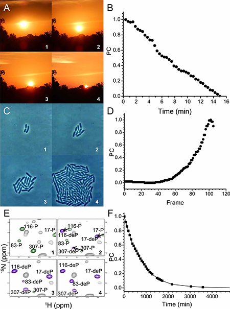
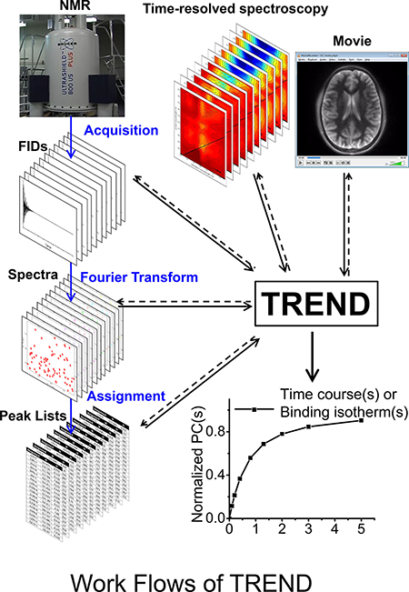

## TREND: TRack Equilibrium or Non-equilibrium shifts in Data
### Resolve Trends such as Binding Isotherms and Time Courses Directly from Spectra, Imaging, or Lists
Version 1.1.0  
For further information, see 
[biochem.missouri.edu/trend](http://biochem.missouri.edu/trend)  
### Introduction:
TREND is a software package that determines the main trend(s) of change across a series of 2D
digital measurements, such as imaging and NMR spectra. TREND works by applying principal component
analysis to non-interpreted 2D digital measurements in multiple formats including spectra (from
NMR, other spectroscopies, and mass spectrometry), raw NMR data, movies, images, lists, and
spreadsheet files. The principal components extracted from them by TREND represent the main
changes among the data frames. These could be binding isotherms, time courses, or a variety of
population shifts. The main requirement is that the data frames be measured consistently in order
to allow quantitative comparison. Series of 2D measurements in an unsupported format may be
converted into a text file or spreadsheet in order to be read by TREND for analysis. The TREND
package includes a program to reconstruct movies or a stack of spectra from the principal
components selected by the user. TREND has been developed for ease of installation under Windows,
Mac OS X, and Ubuntu and Fedora versions of Linux. TREND© (sponsored by NSF) is free for academic
users.
___

   
#### TREND captures main time courses of change of movies or NMR spectra  
***
  

___  

[Academic Software License Request](http://biochem.missouri.edu/trend/academic_request.php)  
[Non-Academic/Commerical Software License Request](http://biochem.missouri.edu/trend/commerical_request.php)  
[TREND Academic Software License Agreement [PDF]](http://biochem.missouri.edu/trend/docs/TREND_LicenseAgreement.pdf)  

If you have any question, please contact <trendmizzou@gmail.com>
