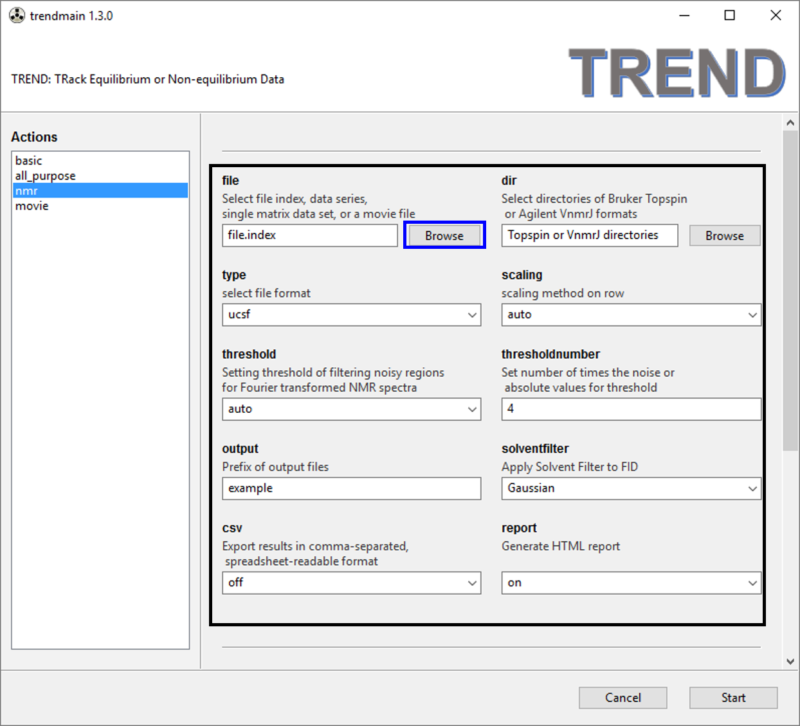
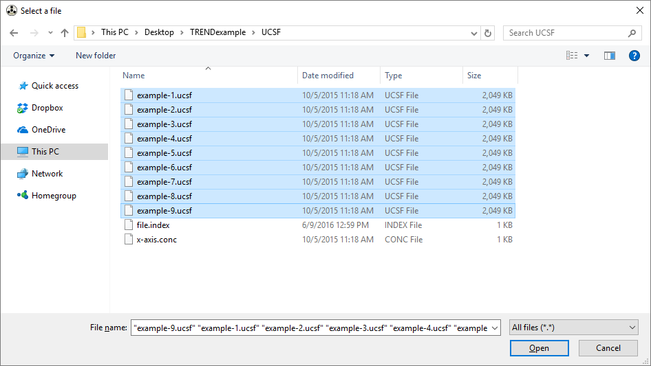
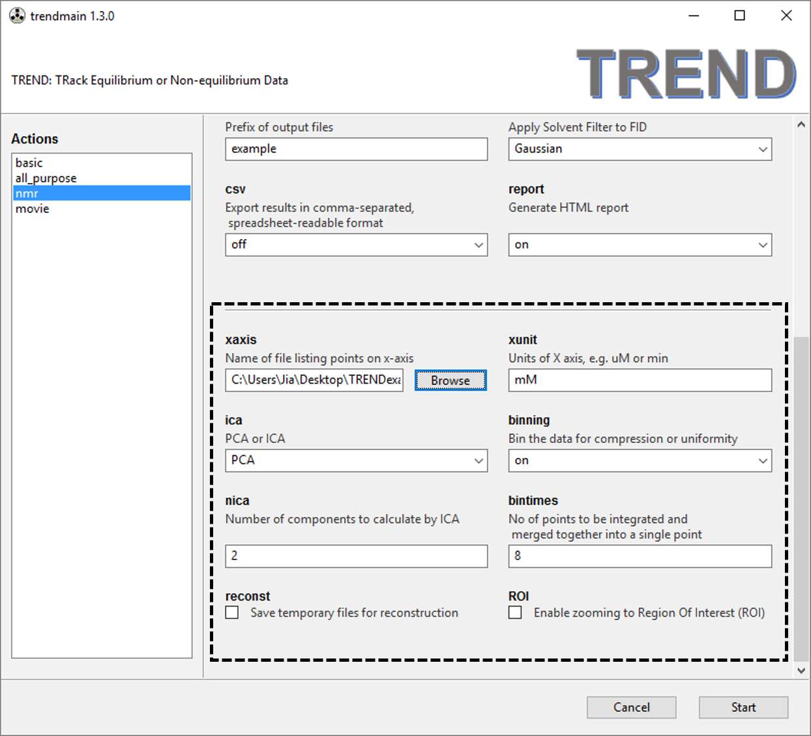
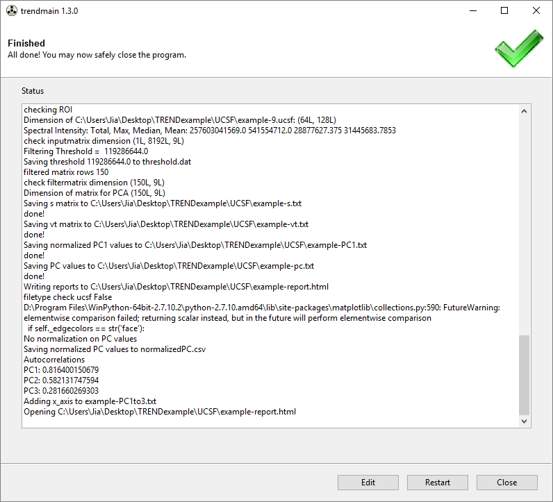
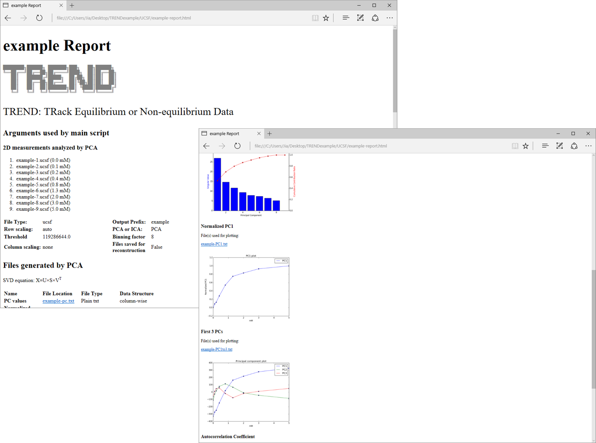

### Simple Example: Determine binding isotherm from NMR spectra in UCSF format

#### _GUI USAGE_

1. Choose `nmr` tab of `trendmaingui` and press browse button highlighted by the box.  
  
  Choose a series of Sparky format spectra (.UCSF files) and TREND will 
  sort them numerically.  
 
2. Specify required arguments including file format, method of scaling 
  rows, the prefix of output files, threshold for smallest signals to be 
  retained (x-fold the noise), whether to export CSV-format spreadsheet 
  files, and whether to generate an HTML report. The default settings are 
  recommended.  
3. Optional arguments are highlighted within the box with dashed line. 
  See the [manual](./manual/GUI.md) for details. Here we specify `xaxis` and `xunits`  
 
4. Press start button, TREND will run for a while and finish.  
   
5. After `trendmain` finishes, an HTML report is generated. It includes the 
  arguments just used, scree plots, and plots of principal components, etc. Please see the manual for details.

  

  #### _Corresponding shell command_

  `trendmain.exe -f file.index -t ucsf -s auto -o example -r auto --report`

  ## Citation

  If you use TREND in your research, please cite these references in resulting publications:   
  [Jia Xu and Steven R. Van Doren, Binding Isotherms and Time Courses Read
  ily from Magnetic Resonance. _Anal. Chem._ 2016, 88 (16), pp 8172-8178](
  http://pubs.acs.org/doi/abs/10.1021/acs.analchem.6b01918)   
      and   
  [Jia Xu and Steven R. Van Doren, Tracking Equilibrium and Nonequilibrium 
Shifts in Data with TREND. _Biophys. J._ 2017, 112,224-233](http://www.sciencedirect.com/science/article/pii/S0006349516343211)

