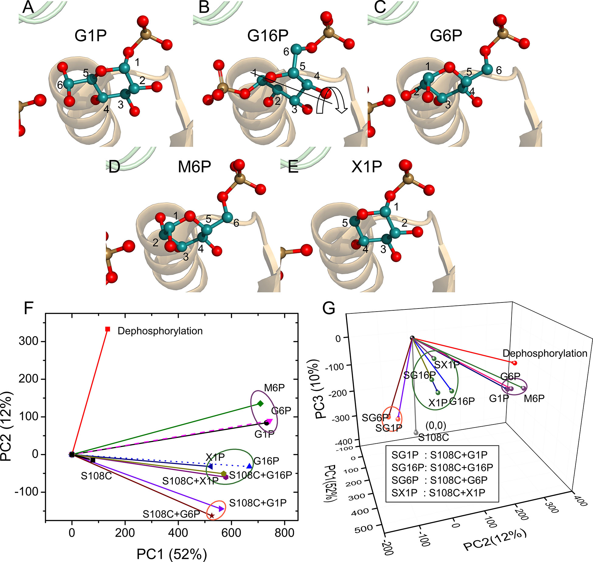

## PCA clustering study: ligands that bind Phosphomannomutase / Phosphoglucomutase (PMM/PGM)  

*A* structure of glucose-1-phosphate,
*B* structure of glucose-1,6-bisphosphate,
*C* structure of glucose-6-phosphate,
*D* structure of mannose-6-phosphate,
*E* structure of xylose-1-phosphate

Clustering and resolution of ligand binding and other perturbations of PMM/PGM based on chemical shift vectors of TROSY spectra. 
Dephosphorylation and mutation of phosphoSer108 to Cys are nearly orthogonal (Xu, J et al
submitted)
