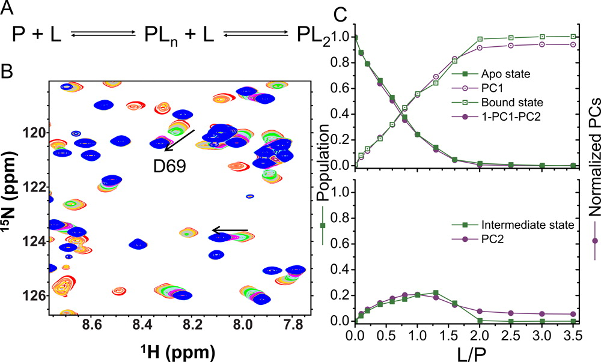

# Mixed Exchange regimes with sequence of two ligand binding reactions  

Principal components from SVD of spectra agree with the populations 
estimated earlier by [line shape
analysis](http://onlinelibrary.wiley.com/doi/10.1002/chem.201000498/abstract) 
for a titration of two 
sequential binding events. 
(Fig 4 in [Xu J and Van Doren SR. Binding Isotherms and Time Courses Readily from Magnetic Resonance. Analytical Chemistry 2016 Aug 16;88(16):8172-8.](http://pubs.acs.org/doi/abs/10.1021/acs.analchem.6b01918)) 
