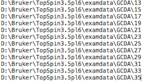

### Main Script - Obtain Principal Components from a series of 2D Measurements

* #### This describes the options of the CLI (Command Line Interface) program (which underline the  GUI version described above)  

  GUI: `trendmaingui.exe` in Windows and Linux, `trendmaingui.app` in OS X

  CLI: `trendmain.exe` on all platforms

* #### Synopsis

  `trendmain.exe -t [ucsf/fid/ft2/png/movie/txt/sparky/csv/excel/…] -f [file index]
  -r [threshold] -o [output prefix name] -s [scaling methods] [-x [xaxis file]] [-u [Unit]]
  [--report]`

* #### Description

  `trendmain.exe` reads a series of NMR spectra, FIDs, png images, the 
  Joint Committee on Atomic and Molecular Physical data - Data eXchange 
  (JCAMP-DX) format, plain text files, comma-separated (CSV) or Excel 
  spreadsheets listed in the index file.

  `trendmain.exe` also reads and process a single file, including movie, 
  an Excel spreadsheet, a comma-separated (CSV) text file, a JCAMP-DX 
  file with multiple blocks, or a plain text file.  TREND preprocesses 
  them, applies singular value decomposition to provide U, s, and V matrices 
  ([Jia Xu and Steven R. Van Doren, Binding Isotherms and Time Courses Readily from Magnetic Resonance. _Anal. Chem._ 2016, 88 (16), pp 8172-8178](http://pubs.acs.org/doi/abs/10.1021/acs.analchem.6b01918)). 
   Its routine mode is to provide principal components (PCs) from the 
  first few rows of the V matrix. TREND also has options to perform PCA 
  reconstructions of the original data series or to perform 
  independent components analysis (ICA). The S and V matrices and normalized 
  PC1 values are output as text files in the names of `prefix-s.txt`, 
  `prefix-vt.txt`, and `prefix-pc1.txt`, which reports the binding 
  isotherm. Additional PCs can be requested.

* #### Typical usage with NMR spectra:

  `trendmain.exe -t ucsf -f file.index -r auto -o outfile -s auto --report`

* #### Options
  * `-t [ucsf/fid/ft2/png/movie/txt/complextxt/csv/complexcsv/singlematrix]`

    `-t` specifies the input file format, the default format is .ucsf for NMR 
    spectra. The options for input file formats are:
  	* ##### NMR file options  
    * **ucsf** Sparky ucsf format (default)  
    * **fid** NMRPipe fid format  
    * **ft2** NMRPipe ft2 format  
    * **png** image format (needs Scipy module)  
    * **brukerfid** Bruker Topspin FID format (`fid` or `ser` file 
      in the experimental directory) 
    * **brukerspectra**  Bruker Topspin processed spectra (`1r` (1D) or 
      `2rr` (2D) in the `/pdata/1` subdirectory in the experimental directory . 
      Note currently the processed spectra must be saved by setting 
      processing number as 1 in the Topspin experimental directory    
    * **agilentfid** Agilent VnmrJ (OpenVnmrJ) fid. (`fid` file in the 
      data directory)  
    * **agilentspectra** Agilent (Varian) VnmrJ (OpenVnmrj) fid. (`phasefile` 
      in the `datdir` subdirectory. Note in order to make `phasefile` 
      readable by third-party software including TREND, set trace='f1', 
      display the full spectrum, and use the VnmrJ `flush` command are 
      required. Otherwise the `phasefile` will be all zero values. See 
      the [Sparky manual](https://www.cgl.ucsf.edu/home/sparky/manual/files.html#ConvertVarian) for details. 
	  **Note** TREND supports on-the-fly analysis on Bruker and 
      Agilent spectrometers. Please note that TREND identification of 
	  principal comopnents can be disrupted by a change in acquisition 
	  parameters or an outlier among the spectra. Consequently, all 
	  spectra or data frames to be analyzed by TREND should be 
      collected and processed under identical conditions. Therefore, 
	  in the case of NMR spectra, 
      we highly recommend using the same set of `NMRPipe` scripts to 
      convert Bruker or Agilent data into NMRPipe **fid** and **ft2** formats.  
  	* ##### Other input formats: text, spreadsheet, JCAMP-DX spectra, and movies  
    * **txt** Data stored in plain text format delimited by spaces, this 
      option could be used for other spectroscopy methods such as time-
      dependent 2D-IR.  
    * **csv**  csv format is supported by Excel, OpenOffice and many 
      software for spectroscopy instruments.  
    * **complextxt** Similar to plain text format (`txt`) but using complex
      number in the form of `0.00+0.00j`.  
    * **complexcsv**  Similar to csv format. However, each cell should be in
      the format of `0.00+0.00j`.  
    * **excel** Microsoft Excel format (xlsx is preferred, the older xls
      format is also accepted). All cells must be float or complex numbers. 
      The complex number should be in the form of `0.00+0.00j`. By default an
      Excel file contains three sheets, only the first sheet is analyzed. 
      Excel with multi-sheets can be processed as `singleexcel` option.    
    * **sparky** or **sparkylist** Sparky list format. The 1st column lists any residue 
      assignments. The 2nd and 3rd columns are F1 (often 15N) and F2 (often 
      1H) chemical shifts, respectively.  
    * **singlematrix** This mode serves as a general PCA tool to process a 
      single matrix in the text format delimited with spaces.   
    * **singlecsv**  Similar to `singlematrix` format but in `csv` format
    * **singleexcel**  Similar to `singlematrix` and `singlecsv` formats but
      in the `xlsx` or `xls` formats. Besides, a series of 1D or 2D dataset 
      can be stored in a single Excel file containing different, 
      sequentially-ordered sheets.  
    * **movie** Common video formats, such as `.ogv`, `.mp4`, `.mpeg`, 
      `.avi`, `.mov`, `.webm`   
    * **jcamp** JCAMP-DX is a general format for exchanging and archiving 
      data from many instruments, including but not limited to IR, Raman, 
      Uv-Vis, Fluorescence, NMR, and EMR. The data stored in JCAMP-DX 
      files can be spectral plots, contours, or peak tables.  JCAMP-DX 
      is very flexible in order to support most kinds of computerized 
      instruments. As a result, it is impractical to support all 
      existing JCAMP-DX variants. However, TREND supports most common 
      JCAMP-DX formats. The digital data in JCAMP-DX can be **AFFN** 
      (ASCII FREE FORMAT NUMERIC) form or **ASDF** (ASCII SQUEEZED 
      DIFFERENCE FORM). TREND supports decoding compressed data, 
      including `PAC`, `SQZ`, `DIF`, `SQZDUP`, and `DIFDUP`. Two most 
      common tabular data form, `(X++(Y..Y))` and `(XY..XY)` are supported. 
      TREND reads a series of JCAMP-DX files, or a single JCAMP-DX file 
      with one or multiple blocks. TREND supports `NTUPLE` format 
      (introduced by JCAMP-DX 5.0 standard), which is designed for 
      multi-dimensional techniques with data sets of multiple variable. 
      For example, JCAMP-DX NMR uses `NUTPLE` to show mixed real/imaginary 
      FID data sets. See [http://www.jcamp-dx.org/](http://www.jcamp-dx.org/), 
	  [https://badc.nerc.ac.uk/help/formats/jcamp_dx/](https://badc.nerc.ac.uk/help/formats/jcamp_dx/) and [http://wwwchem.uwimona.edu.jm:1104/spectra/testdata/index.html](http://wwwchem.uwimona.edu.jm:1104/spectra/testdata/index.html) 
	  for details of JCAMP-DX formats.   
 * ##### Reading a collection of files or spectra:  
  * `-f [fileindex/filename]`

    `-f` reads file index and is required

    * `[fileindex]` is a text format index referring to the  series of NMR 
      spectra, images, lists, or directories (for Bruker Topspin and 
      Agilent VnmrJ data). The default file index name is `file.index`.
      An example is a series of five .ucsf files named numerically. The index
      file can be named as `index.ucsf` and includes the following lines in 
      the example:  
        
      Another example is a series of Bruker Topspin directories on a 
      Windows machine. Absolute paths are supported, as well as relative 
      path, which is shown in the example of `UCSF` files. This 
	  "directory list" can be used for both **brukerfid** and 
	  **brukerspectra**. For 
      **brukerfid** data, TREND will read `fid` or `ser` data from the 
      listed directories. For **brukerspectra** data, TREND will read 
      `1r` or `2rr` files from the `pdata/1` subdirectorires. Therefore, 
      the number of the pdata subdirectory for processed files must 
	  always be set as `1`.   
           
      `file.index` for Agilent VnmrJ format could be used in a simmilar manner, 
      except its spectra are saved in the `datdir` subdirectories.   
    * [filename] can be the name of a singlematrix data set or a movie file 
      for processing.  
 * ##### Preprocessing options:  
  * `-s [none/noscaling/auto/pareto/]`

      `-s` specifies scaling method applied on rows of the data matrix.

    * **none** means skip centering and scaling of the rows of the data 
      matrix.  
    * **noscaling** means do data centering without scaling. It should 
      be accetable in most conditions.  
    * **auto** means Autoscaling. It treats all peaks or features as equally
      important but inflates the measurement errors. It is recommended for NMR
      spectra in fast and slow exchange regimes.  
    * **pareto** means Pareto scaling. It reduces the importance of large 
      peaks but enhances the low, broader peaks. It is recommended for NMR 
      spectra in intermediate exchange.  
    * Definitions of the scaling methods are given in: [_J. BMC Genomics 2006, 
      7, 142_](http://bmcgenomics.biomedcentral.com/articles/10.1186/1471-2164-7-142). 
	  Other scaling options mentioned in this paper, such as _**vast**_
      scaling, **range** scaling, **level** scaling are also provided.  

  * `-r [auto/1e5/3T/5t]`

    `-r` sets the threshold for filtering low intensity regions. The threshold 
    is meaningful when processing  2D NMR spectra (ucsf, ft2), but not for FIDs
    or images in png format. There are three ways to set the threshold: auto, 
    absolute, and manual (set the number of times the noise level).

    * **auto** In **auto** mode the program determines noise from the first 
      spectrum and set threshold as 4 times of the noise level for autoscaling
      and 0.5 times the noise level for Pareto scaling.  
    * **1e5**: When the arguments are set as integral numbers or floating point
      numbers , such as `1e5` or `100000`. This is used to specify the 
      threshold value using the numbering scale of the measurement.  
    * **3T** or **5t**: Numbers with suffix `T` or `t` annotates  times of 
      noise level of the first spectrum. In this mode threshold is set as 3 or
      5 times of noise level of the first spectrum. Three to seven-fold (3T to 
      7T) is the recommended range for NMR spectra.  

  * `-o [output prefix name]`

    `-o` specifies the prefix of output files `prefix-s.txt`, `prefix-vt.txt`, 
    `prefix-pc.txt`, and `prefix-PC1.txt` from PCA. `prefix-pc.txt` reports all
    principle components as successive vertical columns. `prefix-PC1.txt` 
    reports the first principal component as a single vertical column, which in
    a titration is the binding isotherm.

    For example, the option `-o test` generates output files named as 
    `test-s.txt`, `test-vt.txt`, `test-PC.txt`, `test-PC1.txt`

    `prefix-s.txt` and `prefix-vt.txt` save S and VT matrices in the SVD 
    calculation. U matrix is by default omitted because its usually big size.

    When ICA is used instead of PCA (`-i` option is on), the prefix includes 
    `prefix-vt.txt`, which is unmixing matrix, and `prefix-IC.txt`, which reports
    normalized independent components as successive vertical columns.

  * `--csv` 
    When `--csv` is turned on, data in `prefix-s.txt`, `prefix-pc.txt`, 
    `prefix-PC1.txt`, or `prefix-IC.txt` are generated as CSV files, which can 
    be read by software such as Excel or OpenOffice. The corresponding file 
    names are `prefix-s.csv`, `prefix-pc.csv`, `prefix-PC1.csv`, `prefix-IC.csv`.
    In csv files (except `prefix-s.csv`), data is organized as sucessive 
    vertical columns, where the first column represents component number. A 
    table header is added, such as `# Component, PC1, PC2, PC3 ...`.  
  * `-b`   
    Traditional uniform binning is applied for NMR data when `-b` option is 
    turned on, it does not improve accuracy but may be useful when the input 
    dataset is too large. By default `-b` option is `off`. `bintimes` option 
    needs to be set in this condition.  
  * `--bintimes [binning time]`  
    Number of points to be integrated and merged together into a single point. 
    The default is 8. For example, if the size of a 2D spectra is 1024*2048, 
    setting `--bintimes 8` causes size of binned spectra to become 
    1024/8 _ 2048/8 = 128 _ 256  
  * `--columnscaling [none/noscaling/auto/pareto]`  
    `--columnscaling` specifies the scaling method applied on columns of the 
    data matrix. Options and meanings of scaling methods are defined in the `-s`
    option. By default `--columnscaling` is set as [none].   
  * `--solventfilter [none/Gaussian/sine-bell/sine-bell-square]`  
  	`--solventfilter` applies solvent filter to FID signals in `fid`, 
	`brukerfid`, `agilentfid` and `jcamp-dx` format    
	**none** means no water filter will be applied   
	**Gaussian** applies solvent filter with Gaussian filter   
	**sine-bell** applies solvent filter with sine-bell shaped filter  
	**sine-bell-square** applies solvent filter with squared sine-bell shaped filter  
	**rectangular** applies solvent filter with boxcar filter  
	See [nmrglue reference guide](http://nmrglue.readthedocs.io/en/latest/reference/proc_bl.html#user-functions) 
	and [Marion et al, J Mag Reson 1989 84, 425-430](http://www.sciencedirect.com/science/article/pii/0022236489903910) 
	for details.  
  * `-i` or `--ica`  
    This option uses the independent component analysis (ICA) module instead of
    PCA.  
  * `--nica`  
    When ICA is used, the number (n) of components to be calculated must be set
    as `--nica n`. The default n is 2.  
  * `--reconst`  
    `--reconst` is an option for reconstruction. It has no effect on the 
    calculation, but dumps necessary files for reconstruction in the future  
  * `--keepfiltered` is an option for 2D NMR spectra reconstruction when 
    `--reconst` is on. When the input files are 2D NMR data such as ucsf or ft2,
    a threshold can be set using the `-r` option. All data points below the 
    threshold are filtered out. `--keepfiltered` dumps the filtered data points
    to a file for reconstruction purpose. This file is not required because 
    reconstruction of PCA can be done without the filtered data points.  
  * `-x [xaxisfile]`   
    `-x` specifies the name of file containing the list of tick marks to be used
    for the x-axis. It is optional. By default this option is off and x-axis 
    ticks are integers. When `xaxisfile` is specified, numbers within it will 
    form the x-axis. The number of rows in `xaxisfile` should identical to 
    `index` file specified by the  `-f [fileindex]` option of `trendmain.exe`  
    For example, `concentration.txt` lists the five concentrations of a 
    titration, one per line:   
       
  * `-u [Unit]`   
    `-u` specifies label placed on the X-axis for plotting. [Unit] can be any 
    string.  
  * `--report`  
    `--report` generates an HTML file named as `prefix-report.html` that reports
    the results. The report lists arguments used for calculation and files 
    created. It plots the first 3 PCs or ICs without normalization. It 
    also plots scree plot as well as autocorrelation coefficences that 
    represent the smoothness of component curves. For more control of 
    plotting of principal or independent components display, please use
    `trendplot.exe`.  
 	* ##### Movie processing options:  
  * `--compress [compress factor]`  
    When processing **movie** the video can be resized by [compress factor] to 
    reduce computational cost. For example, 0.8 means the video size
    will be resized to 80%. [compress factor] can be cho  sen from the interval 
    (0, 1.0]. By default [compress factor] is set as 1.0, which means use all 
    the data, i.e. don't compress the data.
  * `--sparsity [sparsity factor]`   
    This option controls skipping frames of the input video file by picking up 
    every n-th frame from the video, where n is specified by [sparsity factor].
    For example, a [sparsity factor] of 1 means all frames will be used. 2 uses 
    every second frame, 3 uses every third frame, and so on.  
  * `--starttime [start time]`  
    TREND supports making a subclip of the input movie by setting its 
	starting and ending time. 
    The default value for `--starttime` is 0.0. The numerical format 
	for setting the 
    start time and end time could either be floating point numbers of seconds 
    (e.g. `0.2` stands for 0.2 s), or `hh:mm:ss.ff`, such as `00:03:05.00`, 
    which means 3 minutes and 5 seconds.  
  * `--endtime [end time]`  
    This option sets the ending time for the subclip of input movie. By default 
    it is set as `end`. When `--starttime` and `--endtime` are set as the default 
    (`0.0` and `end`, respectively), the whole input video will be analyzed. 
    Otherwise a subclip video will be analyzed and exported as `from-starttime-to-endtime_movieclip.mp4`, 
    or `from-starttime_movieclip.mp4` if the `--endtime` is set as the default `end`.  
