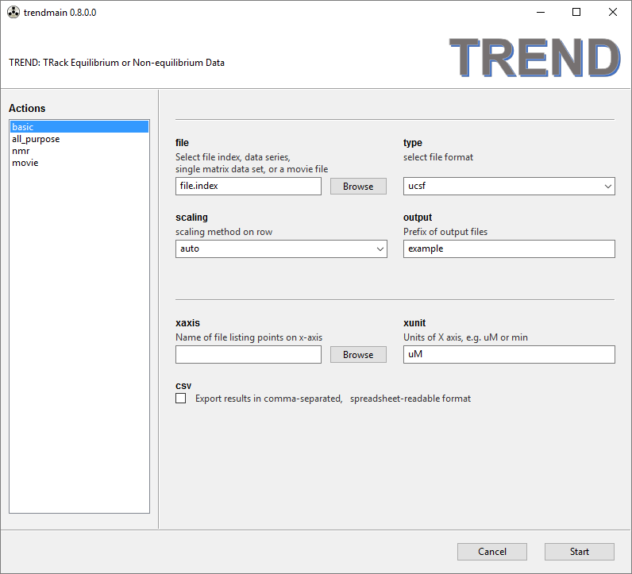
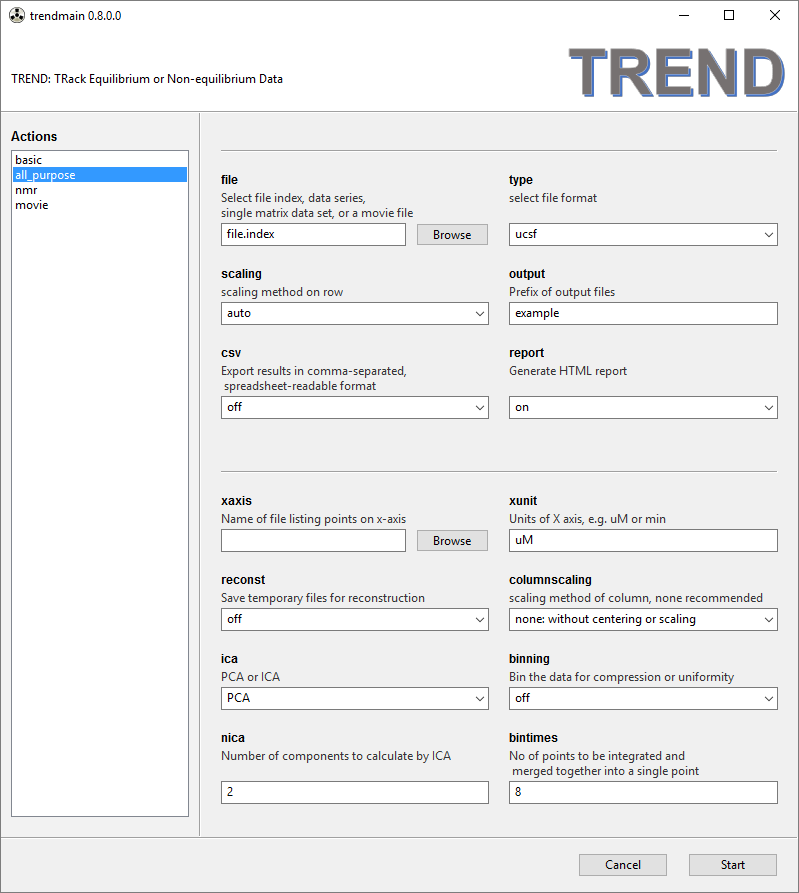
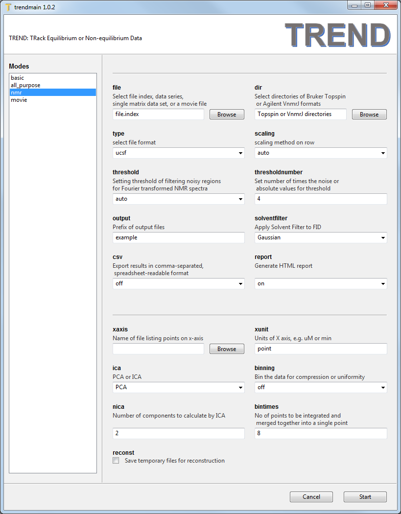
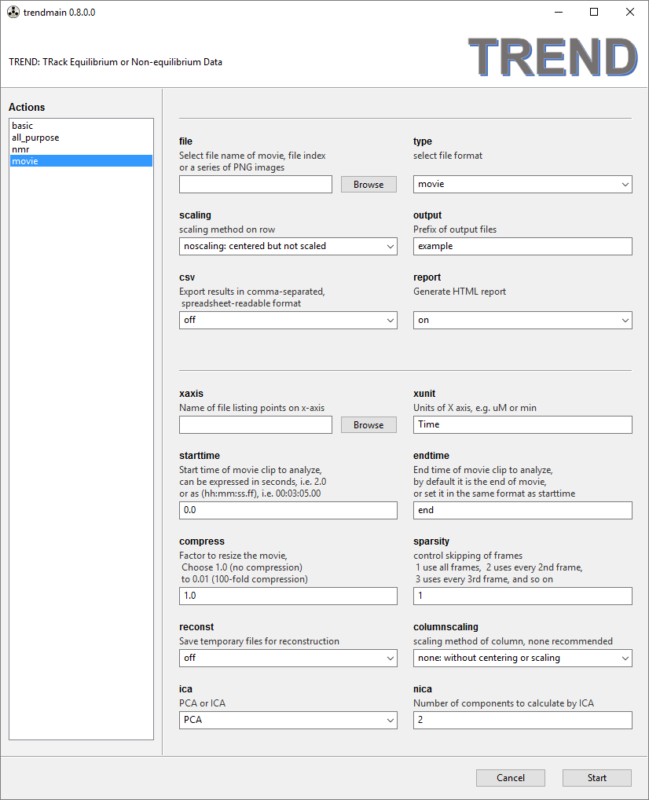

### Trendmain - Obtain Principal Components from a series of 2D Measurements
- Launch using `trendmaingui.exe` or `trendmaingui.app`. In the  left side 
bar, there are four modes to choose from: **`basic`**, **`all_purpose`**, 
**`nmr`**, and **`movie`**. They function similarly with minor differences.  
   
- The **`basic`** menu can be used for simple PCA work. A series of 2D data 
files (or an index file listing the series of data files) can be read by 
the `file` File Chooser widget. Note the `file` File Chooser can do two 
things:  If input file names contain numbers, TREND can extract numbers 
from the file names and sort these names numerically. A corresponding 
file index (`file.index`) will be generated automatically. Or you can 
make a file index manually with a text editor according to the format 
described in the [manual](../CLI/trendmain.md).  
- Choice of file format, scaling methods (on rows), prefix of output file names can 
also be specified. The lower half of the panel shows optional arguments 
(which can be left blank). A file list the tick marks for the X-axis can be 
selected by the `xaixs` File Chooser. The units of the X-axis can also be 
specified and will take effect if a file listing the points of the X-axis measured 
is selected in `xaxis`. When the 
`csv` checkbox is turned on, the PCA results will be exported in 
comma-separated (CSV) format that can be read by spreadsheets such 
as Excel or OpenOffice. The  `report` checkbox is on by default. This 
generates an HTML report of arguments used by main script, links to files 
generated by PCA (PC values, normalized PC1, other files for plots, the 
S matrix, etc), and illustrations of the scree plot, normalized PC1, 
first 3 PCs, and autocorrelation coefficents.  
   
- The **`all_purpose`** menu provides additional options. When the `reconst` 
option is turned on, temporary files are saved for later use in 
reconstruction of the data from the components specified.  Scaling of 
columns can be specified, but should not be necessary if the rows are 
scaled. If the input file type is Fourier-Transformed NMR spectrum 
(NMRPipe `ft2` format or Sparky `UCSF` format), the spectra can be 
"binned" for compression or uniformity. The `bintimes` parameter for this 
 can be speicified. Detail descriptions can be found in the [manual](../CLI/trendmain.md). 
 In the **`all_purpose`** menu,  ICA (independent component analysis) can be selected instead of PCA. 
 When `ICA` is chosen, the number of independent components to be calculated 
should be specified (
  [Jia Xu and Steven R. Van Doren, Tracking Equilibrium and Nonequilibrium 
Shifts in Data with TREND. _Biophys. J._ 2017, 112,224-233](http://www.sciencedirect.com/science/article/pii/S0006349516343211)

The **`all_purpose`** menu supports various formats, including **JCAMP-DX**, which 
is a general format for exchanging and archiving data from many instruments, 
inlcuding but not limited ot IR, Raman, Uv-Vis, Fluroescence, NMR, EMR,
mass spectrometery, and chromatography.   
- The **`nmr`** menu is for analysis of NMR spectra. It is similar to the 
**`all_purpose`** menu but offers selection of data only in these formats: 
**JCAMP-DX**, NMRPipe **fid** and **ft2**, Sparky **ucsf** and Sparky peak 
list as **sparkylist**, Bruker Topspin FIDs and spectra as **brukerfid** 
and **brukerspectra**, and Agilent (Varian) VnmrJ FIDs and spectra as 
**agilentfid** and **agilentspectra**. The Topspin and VnmrJ formats are 
saved as directories, in contrasting them with the other formats that 
save data as individual files. Therefore 
a `dir` Directory Chooser widget is provided for the Topspin and VnmrJ 
data directories. Its usage is similar to the `file` File Chooser widget 
described previously. Note space is **NOT** allowed in the Topspin or VnmrJ 
directory names. 
A manually made directory index, which is 
in the same form of `file.index` can still be read by the `file` File 
Chooser for parsing Topspin and VnmrJ directories. See [manual](../CLI/trendmain.md) for details.  
    
The default scaling method of rows of the data matrix is **auto**, which 
is recommended for series of NMR spectra in fast or slow exchange 
regimes. **pareto** is recommended for spectra with intermdiate exchange. 
**noscaling** should be acceptable for all exchange regimes. Details of 
choosing scaling method and setting the threshold to filter out noise are 
given in the [manual](../CLI/trendmain.md) and [Jia Xu and Steven R. Van Doren, Binding Isotherms 
and Time Courses Readily from Magnetic Resonance. *Anal. Chem.* 2016, 88 
(16), pp 8172-8178](http://pubs.acs.org/doi/abs/10.1021/acs.analchem.6b01918)  
`threshold` and `thresholdnumber` can be set for filtering noise out of 
NMR spectra. The three ways to set the `threshold` are **auto**, **absolute**, 
and **the number of times the noise level**. In **auto** mode, the program 
determines noise from the first spectrum and sets the threshold as 4-fold 
the noise level for `autoscaling` and 0.5 times the noise level for 
`Pareto` scaling.   
`solventfilter` provides options of applying solvent filter to FID data, 
**none**, **Gaussian**, **sine-bell**, **sine-bell-square** are provided. 
**rectangular** filter is provided in the command-line mode. See the 
[manual](../CLI/trendmain.md) for definitions of solvent filter.  
     
- The **`movie`** menu is for processing movies or time-dependent PNG image 
series. The recommended scaling method of rows is **noscaling**. A file 
listing tick marks for the x-axis can be specified. When processing a 
movie, time will be automatically extracted from the movie and saved as 
`movie_time.txt` for use as x-axis. The movie (but not series of PNG 
images) can be resized to make it smaller by skipping frames of the movie 
and setting the parameters `compress` and `sparsity` according to the 
[manual](../CLI/trendmain.md). TREND can select a certain portion of a 
movie by setting `starttime` and `endtime` parameters. 
The numeric format for setting the start and end time can either 
be floating point numbers of seconds (e.g. `0.2`), or `hh:mm:ss.ff`, such as 
`00:03:05.00`. The default values for the `starttime` and `endtime` are 
`0.0` and `end`, which do not trim the movie.   
