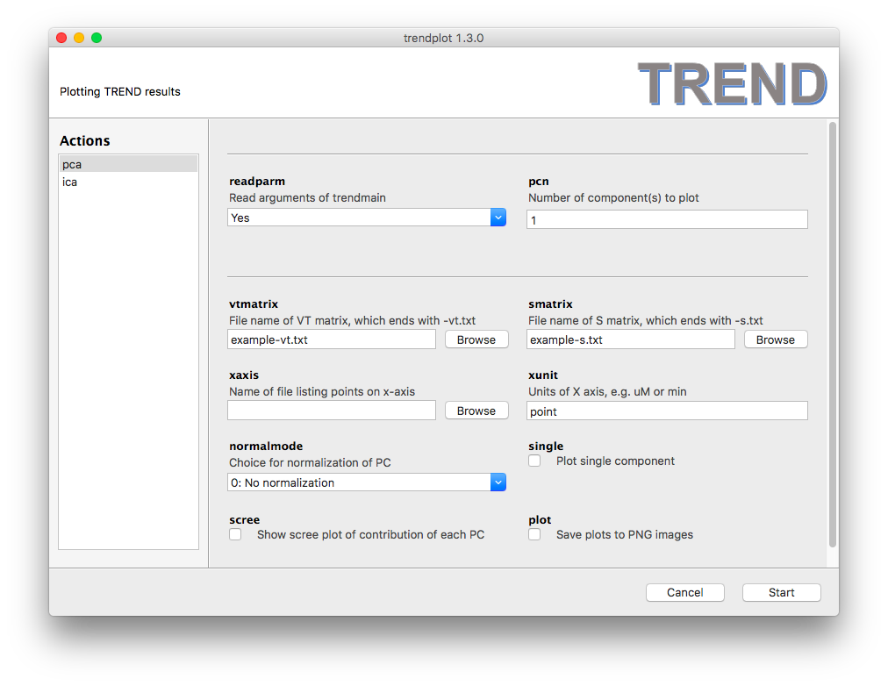
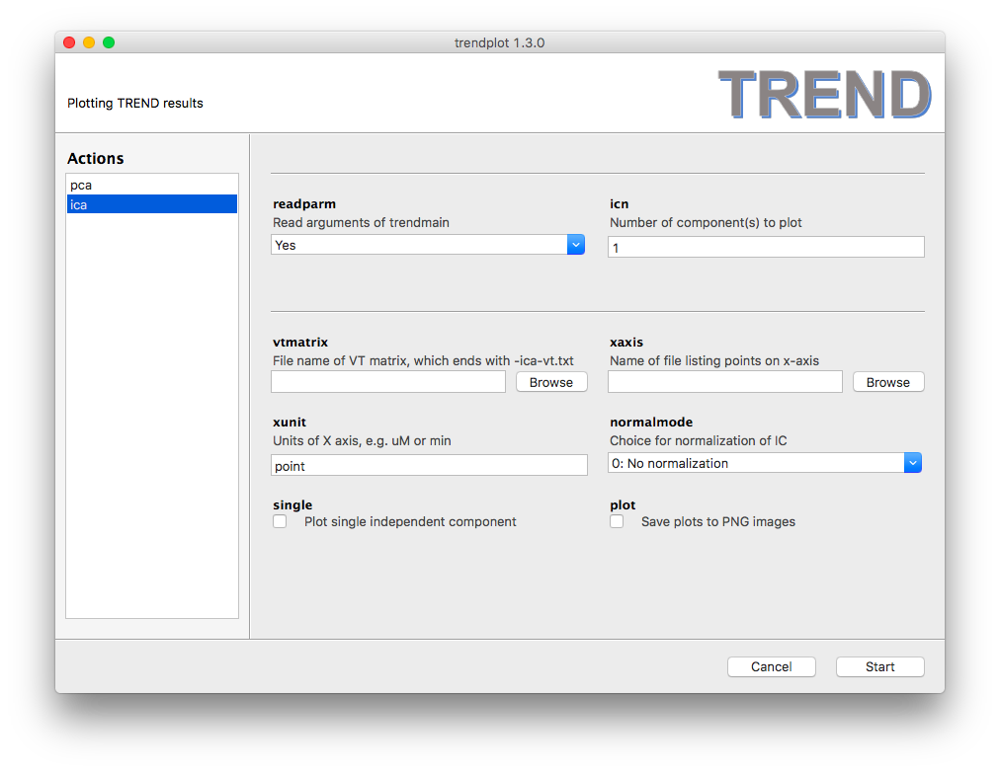

### Trendplot -- display the principal components identified by the main script
- The program for plotting with GUI is `trendplotgui.exe` in Windows and 
Linux, or `trendplotgui.app` ini OS X. Since the `report` option of the main 
script generates an HTML report with several figures including the 
first 3 PCs and scree plot, `trendplotgui` is optional for visualizaing 
results. However, `trendplotgui.exe` provides more control of the number 
of components to plot and how they should be normalized.   
- Note that each time when `trendmaingui` launches it creates a temp directory to
save temporary files for `trendplotgui` and `trendreconstructgui` and 
deletes the old one (if it exists). This poises  `trendplotgui` and 
`trendreconstructgui` to read in the results from the last run of `trendmaingui`.   
   
- There are two modes of `trendplotgui`: PCA and ICA. It is critical to select 
the appropriate mode.  
- **`pca`** mode: The VT matrix and S matrix are needed for plotting PCA results. 
These matrices can be selected using the `vtmatrix` and `smatrix` file 
choosers. However, there is an easier way: Setting `readparm` to `Yes` 
will read the arguments that `trendmain` used and automatically locate 
the matrices as well as the choices of `xaxis` and `xunit`. `pcn` sets 
the first N PCs to be plotted. 
- When the `single` checkbox is turned on, 
`pcn` plots only the Nth PC. The type of normalization can be selected by 
setting `normalmode` according to Table 1 of the [manual](../CLI/trendplot.md).  
- **`ica`** mode is very similar to **`pca`** mode, but does not read `smatrix` 
or show a scree plot.  
   
