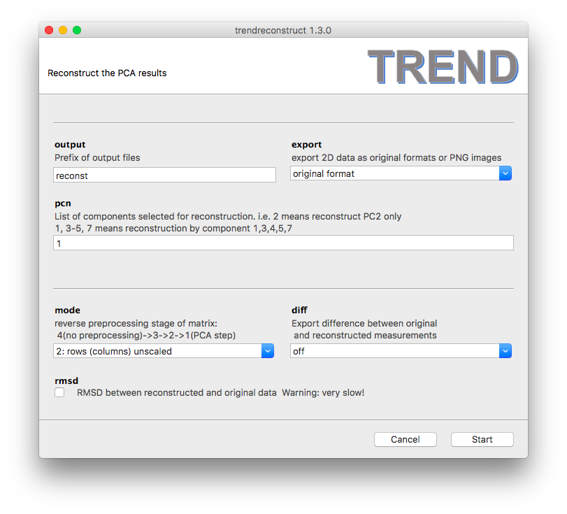

### Trendreconstruct - Use the PCA calculations to reconstruct features in the series of 2D measurements  
- `trendreconstructgui.exe` in Windows and Linux or `trendreconstruct.app` 
in OS X is the program with GUI that uses the results from `trendmaingui.exe` 
to reconstruct single or multiple PC representations of the original 
series of 2D measurements. It is quite self-explanatory. The 
[manual](../CLI/trendreconstruct.md) provides more details.  
- Note that each time when `trendmaingui` launches it creates a temp directory 
to save temporary files for `trendplotgui` and `trendreconstructgui` and 
deletes the old one (if it exists). This prepares 
`trendreconstructgui` processes to read the output of the most recent 
run of `trendmaingui`.   
   
- Since `trendreconstructgui` reads parameters and results from `trendmain` or 
`trendmaingui`, a PCA calculation must first be carried out by `trendmain` 
or `trendmaingui` with the 
`reconstruction` option turned on. 
`trendmaingui` reads the components to use in reconstruction from the 
`--pcn` text box. The syntax it uses is 
equivalent to specifying pages in a print dialog. For example, `1` means 
reconstruct the 2D measurements using only the first component, while `2` 
uses the second component only. `1, 3-5, 7` means reconstruction by 
components 1, 3, 4, 5, 7.  
- When performing reconstruction of a 
PNG image series, choosing to export the `original format` will actually
 generate an `mp4` movie clip. Choosing the `PNG` option instead plots 
 reconstructed images.  

