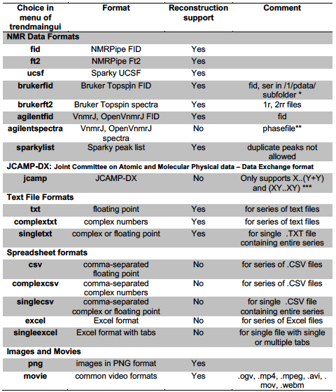

## Table File formats read and reconstructed by TREND$  

  

\$ See [TREND manual](CLI/trendmain.md) for details.   
\* Currently the processed spectra must be saved by setting processing number as 1.  
\*\* In order to make phasefile readable by third-party software including TREND, set trace=’f1’,
 display the full spectrum, and use the VnmrJ `flush` command are required. Otherwise the phasefile
 will be all zero values. See
 [Sparky manual](https://www.cgl.ucsf.edu/home/sparky/manual/files.html#ConvertVarian)   
\*\*\* `JCAMP-DX` is a general format for exchanging and archiving data from many instruments,
 including but not limited to IR, Raman, Uv-Vis, Fluorescence, NMR, and EMR. The data stored in
 `JCAMP-DX` files can be spectral plots, contours, or peak tables. TREND supports the most common
 `JCAMP-DX` formats. The digital data in `JCAMP-DX` can be **AFFN** (ASCII FREE FORMAT NUMERIC) form or
 **ASDF** (ASCII SQUEEZED DIFFERENCE FORM). TREND supports decoding compressed data, including PAC,
 **SQZ**, **DIF**, **SQZDUP**, and **DIFDUP**. Two most common tabular data forms, `(X++(Y..Y))` and `(XY..XY)` are
 supported. TREND reads a series of `JCAMP-DX` files, or a single `JCAMP-DX` file with one or multiple
 blocks. TREND supports NTUPLE format (introduced by `JCAMP-DX` 5.0 standard), which is designed for
 multi-dimensional techniques with data sets of multiple variable. For example, `JCAMP-DX` NMR uses
 NUTPLE to show mixed real/imaginary FID data sets. See http://www.jcamp-dx.org/ ,
 https://badc.nerc.ac.uk/help/formats/jcamp_dx/ and  http://wwwchem.uwimona.edu.jm:1104/spectra/testdata/index.html  for format details

