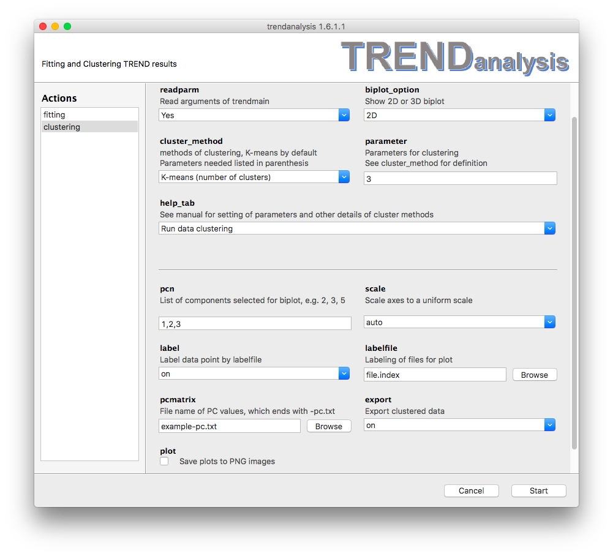

### Clustering of PCA results using TRENDanalysis   
#### Parameters

- The **`clustering`** menu of TRENDanalysis is used to visualize and
  cluster PCA results calculated by by [Trendmain](../../manual/GUI/trendmaingui.md)  or [TREND NMR](../trendmain/README.md)  
- When the **`readparm`** option is turned on (by choosing `Yes`), `TRENDanalysis` 
reads PC values calculated by `Trendmain` or `TREND NMR`. 
If **`readparm`** is turned off (by choosing `No`), the data will be read 
instead from the file specified in the 
**`pcmatrix`** field.  
- **`biplot_option`** indicates which PCA biplots to display. Choices
  are `2D`, `3D`, `Both 2D and 3D`, and `None`.  
- **`cluster_method`** provides options of clustering algorithms, The
  default is `K-means`. Parameters needed are listed in
parentheses.  See details under [Clustering methods](#method)     
- **`parameter`** sets the parameter for clustering. See
  **`cluster_method`** and **`help_tab`** for details.   
- **`help_tab`**  
By default **`help_tab`** is set as `Run data clustering` so that TRENDanalysis
will run display one or two biplots once `Start` is pressed. . 
Other options trigger listing of the parameters relevant to the
**`cluster_method`** selected. Pressing `start` will launch the 
help file in html format.  
- **`pcn`**  
In this field, please list your choice of components to appear in the
biplot, most often 1-3. But could be another combintaion, such as 2,3,5.
At least 3 components must be selected. 
If 4 or more are selected, only the first 3
components will be plotted in 2D or 3D biplots. However, 
clustering results will be calculated using 3 or more components selected.  
The syntax is equivalent to specifying pages in a print dialog. 
For example,  `1, 3-5, 7` means selectinig components 1, 3, 4, 5, 7.  
- **`scale`** controls scaling of output biplots. If `uniform` is chosen
then in 2D or 3D biplots the axes will use the same scale, otherwise
each axis will be scaled automatically.  
- **`label`**  
when **`label`** turns the labeling of data points in biplots on or off.  
- **`labelfile`** refers to the file containg a list of labels for the
  points. 
The format of this file is identical to 
`file.index` (See the [manual of trendmain](../../manual/CLI/trendmain.md) for 
the format of `fileindex`.) **Note** the sequence in a label file must be 
identical to its corresponding [fileindex] file. When no file is chosen
for **`labelfile`**, TRENDanalysis will use the file names to label the
data points in biplots.    
- **`pcmatrix`** When **`readparm`** is turned off, **`pcmatrix`** is 
used to read PCA results calculated by TRENDmain or TREND NMR. 
The file name ends in `-pc.txt`. 
- **`export`**  set to on causes clustering results to be saved as
`prefix-cluster_2d.txt` or `prefix-cluster_3d.txt`   
- **plot**  
When this option is checked, 2D and/or 3D biplots will be saved as
images in the `.png` file format.  

#### 
method

<h4>Choice of clustering method:</h4>  
##### 
kmeans

<li> K-means (number of clusters)</li>  
The K-means algorithm requires the user to specify the number of clusters in
**`parameter`** option. By default it is set as 3. See
[K-means](http://scikit-learn.org/stable/modules/generated/sklearn.cluster.KMeans.html) for
details. 
##### 
agglomerative
  
<li>Agglomerative (number of clusters)</li>  
Similar to K-means, agglomerative clustering also needs the user to specify the
number of clusters.  See [Agglomerative
Clustering](http://scikit-learn.org/stable/modules/generated/sklearn.cluster.AgglomerativeClustering.html#sklearn.cluster.AgglomerativeClustering)
for details.  
##### 
affinity
  
<li>Affinity Propagation (preference)</li>  
Affinity Propagation does not require prior-knowledge of number of clusters. 
Instead, `preference` is
used to choose exemplars. Choose `None` in the **`parameter`** filed
sets `preference` to the median of input similarities. See
[affinity_propagation](http://scikit-learn.org/stable/modules/generated/sklearn.cluster.affinity_propagation.html#sklearn.cluster.affinity_propagation) for details.   
##### 
dbscan
  
<li> DBSCAN (min_sample)</li>  
This option performs Density-Based Spatial Clustering of Applications (DBSCAN) 
clustering. The `min_sample` parameter defines the number of samples to be considered as a core point. 
See
[DBSCAN](http://scikit-learn.org/stable/modules/generated/sklearn.cluster.DBSCAN.html)
for details.  
##### 
meanshift
  
<li>Mean Shift (bandwidth)</li>  
This option applys mean shift clustering. The **`parameter`**  can be
set to `None`. See [Mean
Shift](http://scikit-learn.org/stable/modules/generated/sklearn.cluster.MeanShift.html)
for details.  

