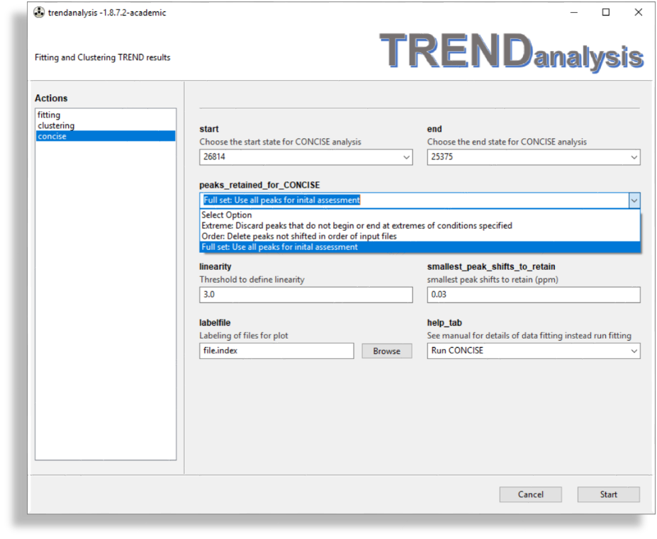
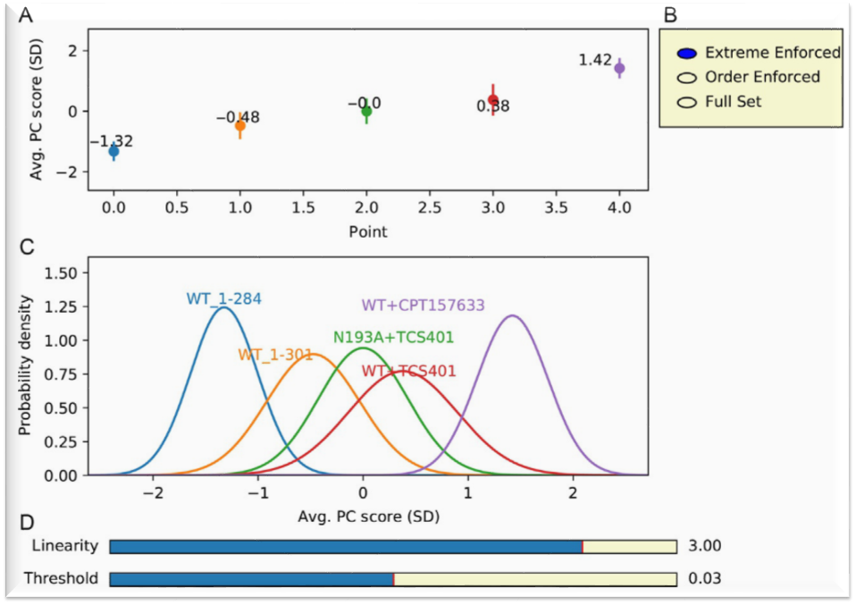

### COordiNated ChemIcal Shifts bEhavior (CONCISE) analysis using TRENDanalysis  
#### Important  
This tab can only be launched **after** the peak lsits were analyzed by the 
[**peaklist**](https://trendmizzou.gitbooks.io/trend_nmr-manual/content/trendpro/trendmain/#peaklist)   tab of 
[TREND NMR](https://trendmizzou.gitbooks.io/trend_nmr-manual/content/trendpro/trendmain/#peaklist)  
#### Paramters

- **`start`** and **`end`** choose the start and end states for CONCISE analysis. 
The peak lists were read in the [`peaklist`](https://trendmizzou.gitbooks.io/trend_nmr-manual/content/trendpro/trendmain/#peaklist) 
tab of tab of [`TREND NMR`](https://trendmizzou.gitbooks.io/trend_nmr-manual/content/trendpro/trendmain/#peaklist)  
#### 
options

- **`peaks_retained_for_CONCISE`** provides three choices of NMR peaks to retain for CONCISE. 1. 
The default option: 1. **Extreme**: `Discard peaks that do not begin or end at extremes 
of conditions specified 2. **Order**: `Delete peaks not shifted in order of input files` 
3. **Full set**: `Use all peaks for inital assessment`  Also see [Interactive Plot](#checkbox)  
#### 
linearity
  
- **`linearity`** Threshold for degree of linearity. It is defined as 
SDPC1/SDPC2.  
[(Cembran et al., 2014)](https://www.ncbi.nlm.nih.gov/pubmed/24604024). 
It can also be adjusted by the Slider of [Interactive Plot](#linearity2)  
#### 
threshold
  
- **`smallest_peak_shifts_to_retain`** filters small shifted peaks whose PC1 peak shifts are 
smaller than the threshold (default: 0.03 ppm).   
It can also be adjusted by the Slider of [Interactive Plot](#threshold2)  
#### 
labelfile
  
- **`labelfile`** refers to the file containg a list of labels for the
  points. 
The format of this file is identical to 
`file.index` (See the [manual of trendmain](../../manual/CLI/trendmain.md) for 
the format of `fileindex`.) **Note** the sequence in a label file must be 
identical to its corresponding [fileindex] file. When no file is chosen
for **`labelfile`**, TRENDanalysis will use the file names to label the CONCISE.   
#### Interactive Plot  
  
An interactive plot is shown after the **Start** button is clicked:  
(A) The average PC score of NMR peak shifts is the average PC1 for the ensemble 
of NMR peak shifts, expressed as the number of standard deviations (SDs) of PC1.
#### 
checkbox
  
(B) Checkboxes for three choices of NMR peaks to retain for CONCISE are shown. 
The **Extreme Enforced** option was chosen for this calculation. **Extreme Enforced** 
selects the subset of residues following the pattern that the peak of the open 
(unliganded) state lies at one extreme position and the peak of the most 
closed complex lies at the other extreme 
[(Cembran et al., 2014)](https://www.ncbi.nlm.nih.gov/pubmed/24604024)  . By default 
extremes are the first and last files in the input files. Other files can be 
chosen as starting and ending states (i.e., extremes) in TRENDanalysis. 
The **Order Enforced** option selects only the subset of residues with
NMR peaks that shift in the order specified by the order of the file names 
of peak lists. Full Set uses all peaks in the assessment.
Also see [**`peaks_retained_for_CONCISE`**](#options)  
#### 
linearity2
  
(C) The conformational populations are represented by replotting the average 
PC score as a Gaussian distribution with the SD shown. The linearity parameter 
is also defined in the field of [**`linearity`**](#linearity)  
#### 
threshold2
  
(D) The interactive slider bars are used to set the minimum linearity and size 
of the peak shifts. These are displayed with the defaults of linearity 
at 3.0 and threshold for peak shifts at 0.03ppm. The threshold is also defined 
in the field of [**`threshold`**](#threshold)  
#### References  
1. [Cembran, A., Kim, J., Gao, J., & Veglia, G. (2014). NMR mapping of protein conforma- tional landscapes using coordinated behavior of chemical shifts upon ligand binding. Physical Chemistry Chemical Physics, 16(14), 6508](https://www.ncbi.nlm.nih.gov/pubmed/24604024').   
2. [Xu, J, Van Doren, S. (2018). Chapter Seven - Affinities and Comparisons of Enzyme States by Principal Component Analysis of NMR Spectra, Automated using TREND Software Methods in Enzymology
607, 2018, 217-240](https://www.ncbi.nlm.nih.gov/pubmed/30149859)   
You can also read the chapter with the [link](https://books.google.com/books?id=mvhqDwAAQBAJ&lpg=PR7&ots=jYrRtoo2kH&dq=Affinities%20and%20Comparisons%20of%20Enzyme%20States%20by%20Principal%20Component%20Analysis%20of%20NMR%20Spectra%2C%20Automated%20using%20TREND%20Software&pg=PA226#v=onepage&q&f=false)   
<iframe frameborder="0" scrolling="no" style="border:0px" src="https://books.google.com/books?id=mvhqDwAAQBAJ&lpg=PR7&ots=jYrRtoo2kH&dq=Affinities%20and%20Comparisons%20of%20Enzyme%20States%20by%20Principal%20Component%20Analysis%20of%20NMR%20Spectra%2C%20Automated%20using%20TREND%20Software&pg=PA226&output=embed" width=500 height=500></iframe>  

