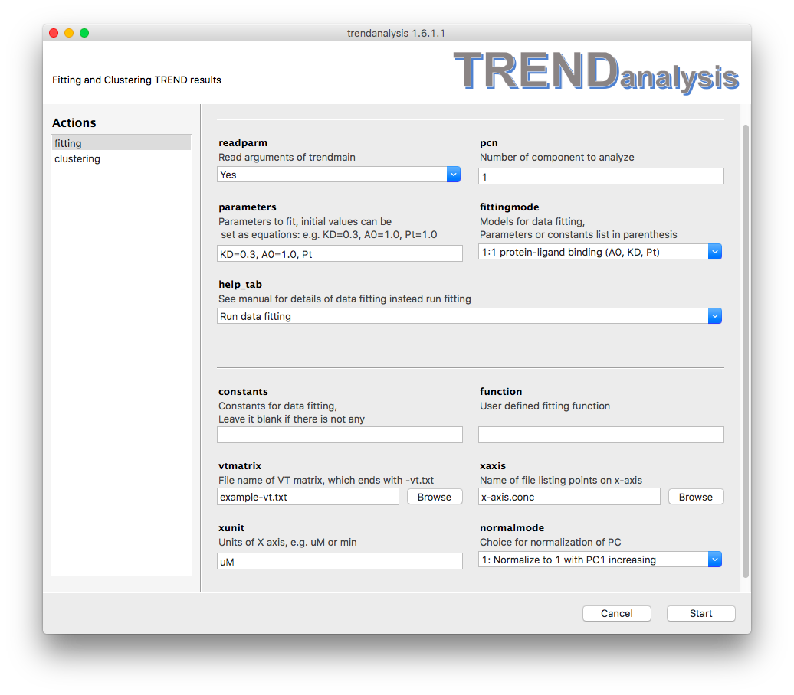
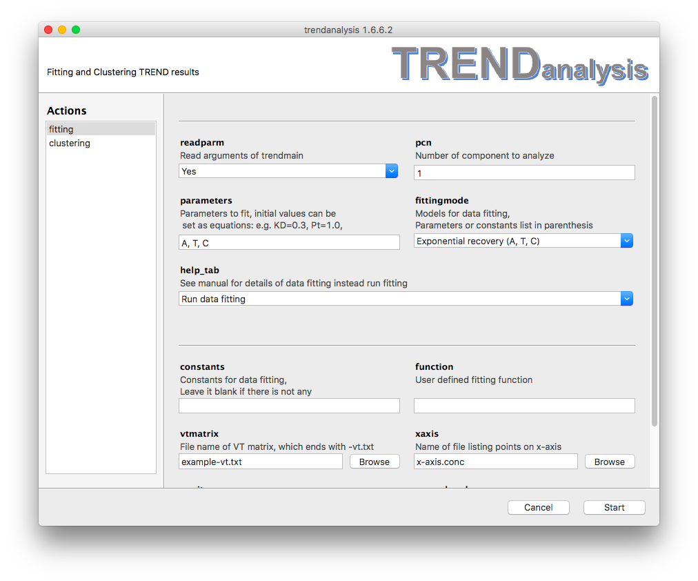
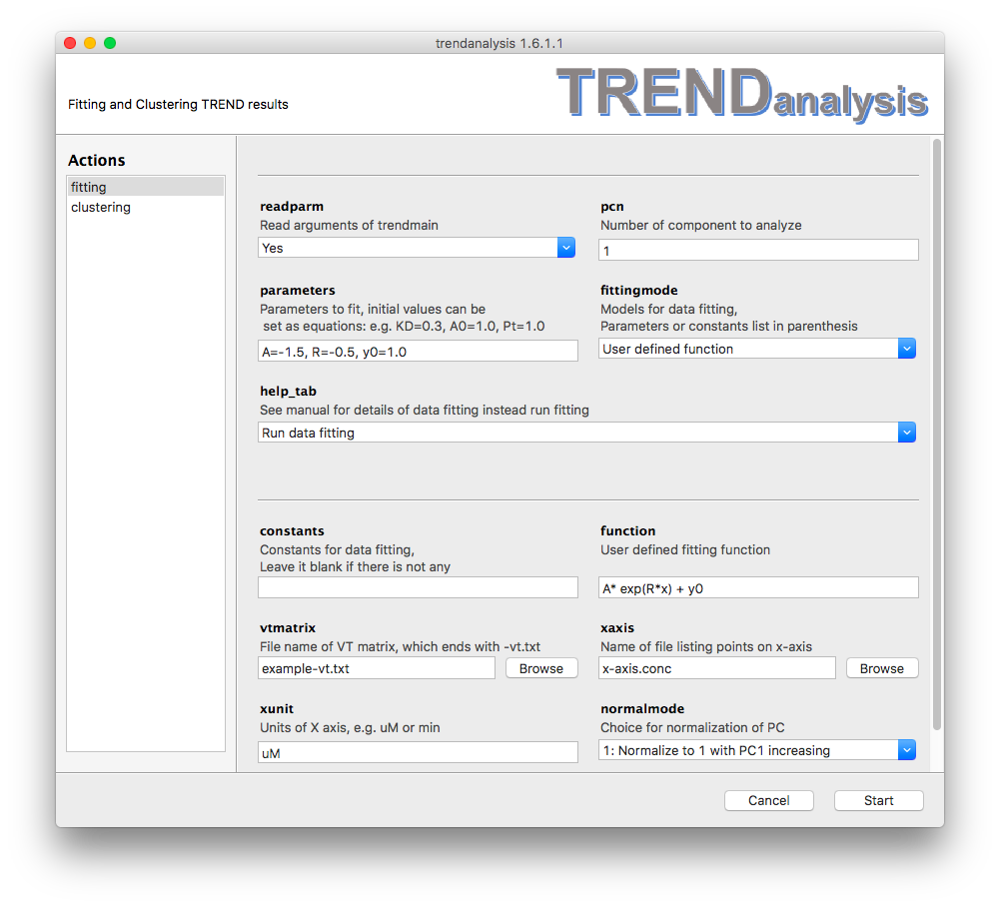

### Fitting of Principal Components or Independent Components using TRENDanalysis   
#### Parameters
- The **`fitting`** is used to fit principal 
components (PC) or independent components (IC) calculatd by [Trendmain](../../manual/GUI/trendmaingui.md) 
or [TREND NMR](../trendmain/README.md). 
To these PCs and ICs, TRENDanalysis fits an equation selected 
in the **`fittingmode`** menu. This can include an equation that you
provide yourself. TRENDanalysis will save 
an html report to directory containing the input data.  
The report will have the suffix of `_fitting_result.html`  

- When the **`readparm`** option is turned on by choosing `Yes`, 
`TRENDanalysis` fits a PC or IC calculated by 
`Trendmain` or `TREND NMR`. The component is recorded by X and Y
coordinates and any units provided for the X-axis. If `readparm` is
turned off by choosing `No`, the PC or IC will be read instead from
**`vtmatrix`**, **`xaxis`**, and **`xunit`**.
- **`pcn`** specifies which PC or IC to fit. It must 
be a positive integer. By default it is set to 1.  
- **`parameters`** specifies the parameters to fit. The 
parameters are separated by commas (`,`). Parameters and their values 
to initialize fitting can be given as equations, e.g.  
e.g. `KD=0.3`. When a parameter is given 
without an inital value, such as `Pt`, the initial value will be set as 1.  
**Note** all parameters must exist in the fitting function specified
under **`fittingmode`**  or **`function`**.  
- **`fittingmode`** allows the user to choose to fit a standard equation
  of TRENDanalysis. 
See  [Fitting models](#fitting-model) for details.  
- **`help_tab`**  
By default **`help_tab`** is set to `Run data fitting` which directs 
TRENDanalysis to fit a curve. 
Choosing an option other than `Run data fitting` will print out 
definitions of parameters listed under the **`fittingmode`** once 
the `Start` button is pressed. This will launch a help file in html
format.  
- **`constant`** specifies which values to fix in the fitting function. 
It can be left blank. Setting constants is similar to setting
**`parameters`**.   
- **`function`** allows user to define their own custom functions. 
See  [User defined functdion](#user-defined) for details. Note that 
equation starts with `y=` is not allowed.  
- **`vtmatrix`**  
When **`readparm`** is turned off, **`vtmatrix`** is used to as the
source of PCA
  results calculated by TRENDmain or TREND NMR. 
- **`xaxis`**  
When **`readparm`** is turned off, **`xaxis`** is used to read the
X-axis file  
- **`xunit`**  
When **`readparm`** is turned off, **`xunit`** sets the unit of X-axis  
- **`normalmode`** sets the normalization mode of PC or IC to be
  fit. See [Trendplot manual](../../manual/CLI/trendplot.md) for details of
normalization mode.  

#### 
fitting-model

<h4> Fitting models:</h4>  
##### 
protein-ligand
  
<li> 1:1 protein-ligand binding (y_end, KD, Pt)</li>  
These three (y_end, KD, Pt) each can be either a parameter to fit (set in
**`parameters`**) or fixed to a constant value (see the **`constant`**
field). This model provides an equation for 1:1 protein-ligand binding:  
$$   
y = \frac{(K_D+x+Pt-\sqrt{(K_D+x+Pt)^2-4xPt)}}{2Pt} \times y_{\_end}
$$
where <i>y</i> is the fraction of bound or free protein (indicated by PC 
or IC), <i>x</i> stands for total ligand concentration <i>[Lt]</i> which is 
listed in the file specified in the **`xaxis`** field in 
`Trendmain`, `TREND NMR` or `TRENDanalysis`, 
 K_D  refers to the dissociation constant 
to fit. You should list an initial guess for the value of 
 K_D  
in the **`parameters`** field.  Pt represents 
the total protein concentration,  y_{\_end}  
represents the amplitude of the y-axis of the binding isotherm at
infinite ligand concentration. When the binding isotherm is represented
by a normalized PC1, the initial value of  y_{\_end}  
can be set to 1.0. **Note**, the unit of  Pt  
must be identical to units of the values of X set in the `xunit` 
field. The binding affinity  K_D  has the same
units.   
An example of 1:1 protein-ligand binding is shown below. 
  

##### 
exponential-rate
  
<li> Exponential decay (A, K, C) </li>  
The function of `Exponential` is  y = C + Ae^{-k \cdot x}
, where <i>A</i> is the amplitude of the difference 
between the initial value and the estimate of the asymptote that
function approaches  C .  C  is the offset of this asymptote from zero, , <i>k</i> is the fitted 
rate constant of the decay. Rate can be calculated as inverse
of t:  R=\frac{1}{t}    
Similar to [1:1 Protein Ligand Binding](#protein-ligand),  C, A, t  must be defined in either
**`pararmeters`** or **`constants`**. 
However, TRENDanalysis can initialize parameters for exponential fitting
(both exponential growth and decay) automatically and hence their
initial values do not need to be set, such as:  
  
##### 
exponential-time
  
<li> Exponential recovery (A, C, T) </li>
The function is  y = C + Ae^{-\frac{x}{T}} ,
where  A  is the amplitutde of the difference
between the initial value and the estimate of the asymptote that the
function approaches  C  is the offset of this
asymptote from zero,  T  is the fitted time
constant of the recovery.  T = \frac{1}{k} , where
 k  is from the exponential decay function,
equivalent to this function.  These parameters must be defined in either
the list of **`parameters`** or **`constants`**.  
  
##### 
two-exponential
  
<li>Two-exponential decay(A1, t1, A2, t2, C)</li>  
The function of `Two exponential` decay is  y =
A_1e^{-\frac{x}{t_1}} + A_2e^{-\frac{x}{t_2}} + C  ,
where  A_1, A_2  stand for amplitudes of the two
phases,  t_1, t_2  are time constants of two
phases, and  C  is the offset between zero and
the asymptote approached at high values of x. The user must choose the
initial values carefully according to the shape of the component and
points to be fitted.    
#### 
langmuir
  
<li> Langmuir equation (KD, Imax) </li>  
This model determines  K_D  by fitting the
binding isotherm with the equation,  
y = \frac{I_{max} \times x}{K_D + x} , where y 
the changes during titration,  I_{max}  refers to 
the maximum intensity change, x refers to 
the total ligand concentration ligand concentration <i>[Lt]</i>, just as 
it does for the [1:1 protein-ligand binding](#protein-ligand) model
above. A recent example applied the Langmuir equation to a titration
measured accurately by WaterLOGSY at low [protein] ([Huang et al., 2017,
*Sci. Rep.*)](http://dx.doi.org/10.1038/srep43727).     
##### 
linear-regression
  
<li>Linear regression</li>  
Since linear regression does not need **`parameters`** or **`constants`**,
these two options are ignored when linear regression 
is chosen. 
##### 
user-defined
  
<li>User defined function</li>  
Besides the models descrbied above, TRENDanalysis also supports
user-defined functions. The equation can be input in **`function`**
text field, while its **`parameters`** and **`constants`** are set in the
same way as descrbied above. **Note** that initial values are very important
for any non-linear curve fitting. In the **`fittingmode`** field, select
user-defined function, and enter the equation in the **`function`**
field as illustrated in this example:   
  
Note that `y=` is not used when entering in the function to be fitted.
It is important that the number of data points in the component to be
fitted exceed the number of fittable parameters by one, at the very
least.  
