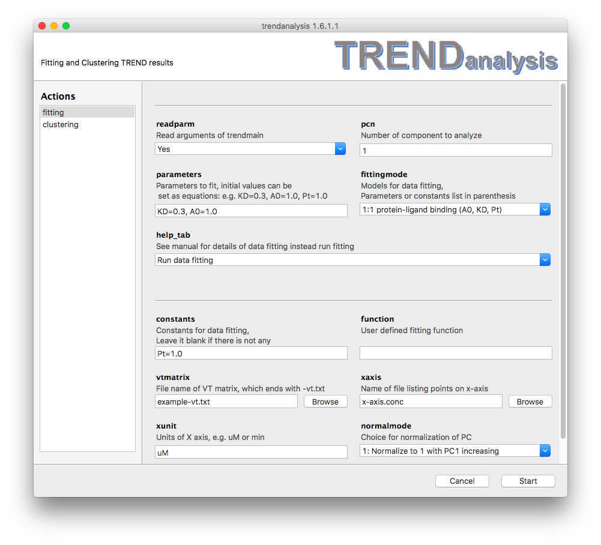

### Fitting of Principal Components or Independent Components using TRENDanalysis   
#### Parameters
- The **`fitting`** menu of TRENDanalysis is used to fit principal 
components (PC) or independent components (IC) obtained by [Trendmain](../../manual/GUI/trendmaingui.md) 
or [TREND NMR](../trendmain/README.md) using models given by **`fittingmode`** 
option or user-defined functions. An html report will be saved to the
same directory of input data with suffix of `_fitting_result.html`  

- When **`readparm`** option is turned on (choose `Yes`), `TRENDanalysis` 
reads data and parameters for fitting from `Trendmain` or `TREND NMR`, 
including y data (PC or IC), x data (`x-axis`), and unit (`xunit`). If 
**`readparm`** is turned off (choose `No`), these data will be read by 
**`vtmatrix`**, **`xaxis`**, and **`xunit`**, respectively.  
- **`pcn`** option specify number of components (PC or IC) to fit. It must 
be a positive integers. By default it is set as 1.  
- **`parameters`** option sets parameters to fit. Multiple parameters are 
separated with commas (`,`). Parameters and corresponding initial values 
can be given as equations, e.g. `KD=0.3`. When a parameter is given 
without an inital value, such as `Pt`, the initial value will be set as 1.  
**Note** all parameters must existing in the fitting function given by 
**`fittingmode`**  or **`function`** options.   
- **`fittingmode`** provides choices of fitting models that are already 
implemented by TRENDanalysis. See <a href=#LigandBinding>Fitting models</a> 
for details.  
- **`help_tab`**  
By default **`help_tab`** is set as `Run data fitting` and TRENDanalysis
will run data fitting as described. Options other than default `Run data
fitting` gives definitions of parameters shown in **`fittingmode`** and
will launch help file in html format.   
- **`constant`** sets constant value in fitting function. If can be
leave blank if there is no value needs to be set as constant. Setting
constant is similar to setting **`parameters`**.  
- **`function`** allows user to define their own functions. See <a
  href=#UserDefine>User defined functdion</a> for details. Note
equation starts with `y=` is not allowed.  
- **`vtmatrix`**  
When **`readparm`** is turned off, **`vtmatrix`** is used to read PCA
  results calculated by TRENDmain or TREND NMR. 
- **`xaxis`**  
When **`readparm`** is turned off, **`xaxis`** is used to read x axis
file 
- **`xunit`**  
When **`readparm`** is turned off, **`xunit`** is used to set unit of
xaxis  
- **`normalmode`** option sets the normalization mode of PC or IC to be
  fit. See [Trendplot manual](../../manual/CLI/trendplot.md) for details of
normalization mode.  

#### Fitting models:
  - <a name="LigandBinding">1:1 protein-ligand binding (y_end, KD, Pt)</a>   
This model provides an equation for 1:1 protein-ligand binding: 
 y = \frac{(K_D+x+Pt-\sqrt{(K_D+x+Pt)^2-4xPt)}}{2Pt} \times y_{\_end} ,
where <i>y</i> is the fraction of bound or free protein (indicated by PC 
or IC), <i>x</i> stands for total ligand concentration <i>[Lt]</i> which is 
given by **`xaxis`** options in `Trendmain`, `TREND NMR` or
`TRENDanalysis`, 
 K_D  stands for dissociation constant, which is the
parameter to be fit here and should be set in the **`parameters`**
textfield, Pt stands for total protein 
concentration,  y_{\_end}  stands for y value 
when ligand concentration 
is infinite. If binding isotherm is represented by normalized PC1 the
initial value of  y_{\_end}  can be set as 1.0. 
They can be either parameters to fit (set in **`parameters`**) or fixed as constant values (set in
**`constant`** texfield) 
**Note**, the unit of  Pt  must be identical to
unit of x values (**`xunit`**), the fitted binding affinity  
K_D  also have the same unit.  
An example of 1:1 protein-ligand binding is shown below. 
  
  - <a name="Exponential">Exponential(A, C, t)</a>  
The function of `Exponential` is  y = C + Ae^{-\frac{x}{t}}
, where <i>A</i> is initial value,   C 
is offset, <i>t</i> is time constant. Rate can be calculated as inverse
of t:  R=\frac{1}{t}    
Similar to <a href=#LigandBinding>1:1 Protein Ligand Binding</a>,  C, A, t  must be defined in either
**`pararmeters`** or **`constants`**. 
However, TRENDanalysis can initialize parameters for exponential fitting
(both exponential growth and decay) automatically and hence their
initial values do not need to be set, such as:  
  
  - <a name="TwoPhase">Two phase exponential(A1, t1, A2, t2, C)</a>  
The function of `Two phase exponential` is  y =
A_1e^{-\frac{x}{t_1}} + A_2e^{-\frac{x}{t_2}} + C  ,
where  A_1, A_2  stand for amplitudes of two
phases,  t_1, t_2  are time constans of two
phases,  C  is offset. Choose the initial
values carefully according to the shape of your curve.   
  - <a name="Linear">Linear regression</a>  
Linear regression does not need **`parameters`** or **`constants`**,
therefore these two options will be ignored when linear regression model 
is chosen. 
  - <a name="UserDefined">User defined function</a>  
Besides implemented models descrbied above, TRENDanalysis also supports
user defined function. The equation can be input in **`function`**
text field, while **`parameters`** and **`constants`** are set in the
same way as descrbied before. **Note** initial values are very important
for any non-linear curve fitting. An example of user defined example is
given as:  
  
It is an example fitting data to exponential equation with rate constant
(R) instead of time constant (t), the equation is:  y=Ae^{Rx}
 + C . Note in the **`function`** textfield 
a function instead of an equation is required. Therefore only
`A*exp(R*x) + C` is allowed, while `y=A*exp(R*x) + C` is wrong.  

 

