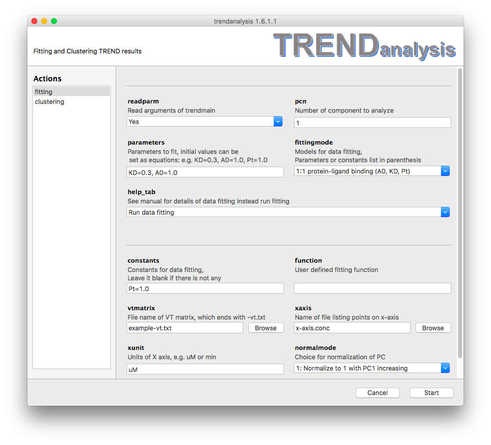

#### Fitting models:
  - <a name="LigandBinding">1:1 protein-ligand binding (y_end, KD, Pt)</a>   
This model provides an equation for 1:1 protein-ligand binding: 
 y = \frac{(K_D+x+Pt-\sqrt{(K_D+x+Pt)^2-4xPt)}}{2Pt} \times y_{\_end} ,
where <i>y</i> is the fraction of bound or free protein (indicated by PC 
or IC), <i>x</i> stands for total ligand concentration <i>[Lt]</i> which is 
given by **`xaxis`** options in `Trendmain`, `TREND NMR` or
`TRENDanalysis`, 
 K_D  stands for dissociation constant, which is the
parameter to be fit here and should be set in the **`parameters`**
textfield, Pt stands for total protein 
concentration,  y_{\_end}  stands for y value 
when ligand concentration 
is infinite. If binding isotherm is represented by normalized PC1 the
initial value of  y_{\_end}  can be set as 1.0. 
They can be either parameters to fit (set in **`parameters`**) or fixed as constant values (set in
**`constant`** texfield) 
**Note**, the unit of  Pt  must be identical to
unit of x values (**`xunit`**), the fitted binding affinity  
K_D  also have the same unit.  
An example of 1:1 protein-ligand binding is shown below. 
  
