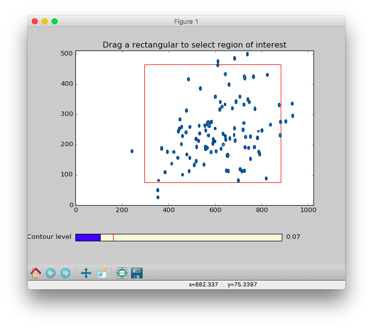

### TREND NMR - Binding Isotherms and Time Courses Readily from NMR  
- TREND NMR is an NMR-optimized improvement upon [Trendmain](../../manual/GUI/trendmaingui.md). 
It requires a minimum of five measurements (collected uniformly) in
order to track a trend among them or to make a comparison.  
- In the left side bar, there are three modes to choose from: **`spectra`**, 
**`fid`**, and **`peaklist`**. They function similarly, 
but differ in small ways. 
- For details of each option, see the [GUI manual](../../manual/GUI/trendmaingui.md) 
and [CLI manual]((../../manual/CLI/trendmain.md)).  
  
##### 
spectra

- **Spectra**  
- The **`spectra`**  menu is used for analysis of NMR spectra. It is similar 
to the **`nmr`** menu of [Trendmain](../../manual/GUI/trendmaingui.md). 
- `TREND NMR` automatically selects the format of NMR spectra. Under the
  `file` heading, there is a file browsing function for choosing a
series of 2D NMR spectra in NMRPipe `ft2`, Sparky `ucsf`, or `jcamp-dx`
formats.  
- Under the `dir` heading, there is a directory browsing function for
  choosing a series of directories containing hFourier-transformed 
Bruker Topspin spectra (`brukerspectra`)(by experiment number) or 
Agilent VnmrJ (`agilentspectra`)   
- Scaling is important for an accurate binding isotherm. Usually `auto`
  is the best choice, but sometimes `pareto` is more accurate. The
default scaling method of rows of the data matrix is `auto`, which is
recommended for series of NMR spectra in fast or slow exchange regimes.
`pareto` is recommended for spectra with intermediate exchange behavior.
Considerations in choosing scaling method and setting the threshold to
filter out noise are given in the Supporting Information of [Jia Xu
and Steven R. Van Doren, Binding Isotherms and Time Courses Readily from
Magnetic Resonance. _Anal. Chem._ 2016, 88 (16), pp 8172-8178](
  http://pubs.acs.org/doi/abs/10.1021/acs.analchem.6b01918)  
- `threshold` and `thresholdnumber` can be set for filtering noise out
  of nMR spectra. The three ways to set `threshold` are `auto`,
`absolute`, and `the number of times the noise level`. In `auto` mode,
the program determines noise from the first spectrum and set the
threshold as 4-fold the noise level for `autoscaling` and 0.5 times the
noise level of `Pareto` scaling.  
- `Compression` of the spectra can be turned on for a faster, more
  economical calculation, if desired. The number of points to group
together can be adjusted interactively using a slider.  
- The `ROI` option allows zooming in on the region of interest (ROI).
  This is useful for avoiding disruptive spectral artefacts, e.g. from
the water or other solvent. 
When the `ROI` option is turned on, a preview of the first spectrum in the 
series will pop up. The ROI can be selected by dragging a rectangular of the spectrum using 
mouse. After this window is closed, a preview of selected ROI will pop up 
and be saved as a `PNG` picture with suffix of `-ROI.png` to the directory 
of input spectra.  
- The contour level can be adjusted by dragging the  
`Contour level` widget in the bottom of the preview. 
  
  
##### 
fid

- **FIDs**  
- The **`fid`** menu is very similar to the **`spectra`** menu but 
should be used if analyzing free induction decays (FIDs). This menu is
simplified for handling FIDs, but adds the `solventfilter` option for
subtrcting an on-resonance solvent signal. FID files such as NMRPipe
`fid`, Simens `RDA`, 
`JCAMP-DX` formats are supported by the `file` browser. Directories each containing a Bruker Topspin FID (`brukerfid`) or 
Agilent VnmrJ FID (`agilentfid`) can be read by the `dir` browser.  
 
##### 
peaklist

- **Peaklists**  
- TREND NMR reads peak lists in `Sparky` and `NMR-STAR` formats in its **`peaklist`** mode. 
Multiple pieces of NMR software can export peak lists in `Sparky` and `NMR-STAR` formats. 
TREND NMR can retrieve `NMR-STAR` files archieved at the Biological Magnetic Resonance Data Bank ([BMRB](http://www.bmrb.wisc.edu/)) 
when the accession codes are listed in a text file.   
It supports the scaling of rows specified in the `scaling` field. There is also 
the option to scale columns, which is specified in the 
`columnscaling` field. [`trendmaingui`](https://trendmizzou.gitbooks.io/trend-manual/content/manual/GUI/trendmaingui.html) 
(the program from the original,
general-purpose TREND package) also reads and analyzes lists in Excel,
CSV, and text files, any of which would be suitable for peak lists.  
 
- *Please configure this if not using 15N HSQC or TROSY spectra:* Under **`sparky_fields_to_use_and_scale`**, the default of "N=0.2, H=1" 
is appropriate for selecting and scaling the correct fields from amide peak lists. 
(These peak lists are generated from widely used 15N HSQC and TROSY NMR spectra.) 
For peak lists from 13C-1H correlation spectra such as heteronuclear single quantum 
coherence (HSQC), heteronuclear multiple quantum coherence (HMQC), and methyl TROSY, 
a similar choice of "C=0.25, H=1" is suitable. Peak lists from 2D homonuclear 1H-1H 
total correlation spectroscopy (TOCSY) or nuclear Overhauser effect and exchange 
spectroscopy (NOESY) could instead be set to "H=1, H=1".  
- **`handling_of_missing_values`** is used to process NMR peak lists differing in the number of peaks. 
The default of `remove rows with missing values` deletes from the calculation those peaks not 
present in all of the lists. `use mean among spectra` handles missing peaks by filling 
the mean value from the other spectra.  `use mean within spectrum` sets missing values as 
the mean of the other peaks in the spectrum.  `set to zero` fills in missing values with 0 for the calculation.  
- **`alternation_or_combination_of_fields`** organizes chemical shift data for the calculation. 
The default option of `interleave (alternate as H, X, H, X, ....)` option reorganizes scaled chemical shift data 
from each spectrum  (scaled by field  **`sparky_fields_to_use_and_scale`**) into a 1D vector for PCA or CONCISE calculation.  See [Sakurai et al PNAS 2007 104 (39) 15346-1535](https://www.pnas.org/content/104/39/15346).   
The `combine (H+X, H+X, ...)` option reduces the dimensionality of 2D or multi-dimensional spectra by calculating combined chemical shfit (CCS) use the weighting factor defined in **`sparky_fields_to_use_and_scale`**. For example, 
the CCS of HSQC ("N=0.2, H=1") is calculated as  CCS = 0.2 \times N + 1 \times H . See 
[Boulton et al, Sci Rep, 2014 Dec 8;4:7306](https://www.nature.com/articles/srep07306).  
- **`referencing_of_peak_lists_to_first_list`** This can be used to reference spectra to the first 
spectrum in the index file for PCA or CONCISE calculation.  
By default, this option is turned off because it assumes the input peak lists are already referenced. 
The `Linear` style of referencing is recommended for CONCISE. (See p6511 in 
[Cembran et all PCCP 2014](https://www.ncbi.nlm.nih.gov/pubmed/24604024)). Referencing 
using root mean squared (RMS) differences 
(see [Xu et al, Sci Rep, 2016](https://www.nature.com/articles/s41598-017-05557-w)) 
between peak positions may also be chosen but can decrease the number of peaks retained by CONCISE.  
can decrease the number of peaks retained by CONCISE.  
- **`filter_small_shifted_peaks`** sets the threshold (in ppm) to discard peaks that 
shift too little. The threshold values are separated 
by commas in the field called **`sparky_fields_to_use_and_scale`**. 
The field is by default turned off (`0.0, 0.0`). When **`sparky_fields_to_use_and_scale`** is 
set as default `N=0.2, H=1` and  **`alternation_or_combination_of_fields`** 
is set to the default of `interleave`,  a `0.02, 0.02` setting of **`filter_small_shifted_peaks`** discard rows 
(either `N` or `H`) whose values vary less than 0.02 ppm across the spectra (i.e. columns). 
If the  **`alternation_or_combination_of_fields`** 
is set to 'combine', the first values in  **`filter_small_shifted_peaks`** is used to filter peaks 
whose CCS vary less than the threshold (e.g. 0.02 ppm) across different spectra.  
- **`coordinated_behavior`**  This checkbox is checked to turn on CONCISE analysis when 
**start** button is clicked at the lower right to start the calculation. 
`TRENDanalysis` can be used to continue 
and adjust the calculations under the CONCISE tab. For example, the first 
and last extreme states may be set. The plot can be labeled using a file 
listing the labels for the peaks. See the [CONCISE manual](../trendanalysis/concise.md#interactive) for details. 

