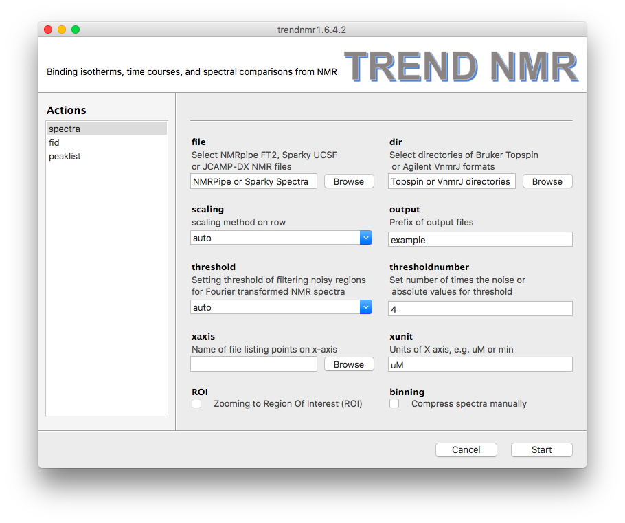

### TREND NMR - Binding Isotherms and Time Courses Readily from NMR  
- TREND NMR is an NMR-optimized improvement upon [Trendmain](../../manual/GUI/trendmaingui.md). 
It requires a minimum of five measurements (collected uniformly) in
order to track a trend among them or to make a comparison.  
- In the left side bar, there are three modes to choose from: **`spectra`**, 
**`fid`**, and **`peaklist`**. They function similarly, 
but differ in small ways. 
- For details of each option, see the [GUI mannual](../../manual/GUI/trendmaingui.md) 
and [CLI mannual]((../../manual/CLI/trendmain.md)).  
  
##### 
spectra

- **Spectra**  
- The **`spectra`**  menu is used for analysis of NMR spectra. It is similar 
to the **`nmr`** menu of [Trendmain](../../manual/GUI/trendmaingui.md). 
- `TREND NMR` automatically selects the format of NMR spectra. Under the
  `file` heading, there is a file browsing function for choosing a
series of 2D NMR spectra in NMRPipe `ft2`, Sparky `ucsf`, or `jcamp-dx`
formats.  
- Under the `dir` heading, there is a directory browsing function for
  choosing a series of directories containing hFourier-transformed 
Bruker Topspin spectra (`brukerspectra`)(by experiment number) or 
Agilent VnmrJ (`agilentspectra`)   
- Scaling is important for an accurate binding isotherm. Usually `auto`
  is the best choice, but sometimes `pareto` is more accurate. The
default scaling method of rows of the data matrix is `auto`, which is
recommended for series of NMR spectra in fast or slow exchange regimes.
`pareto` is recommended for spectra with intermediate exchange behavior.
Considerations in choosing scaling method and setting the threshold to
filter out noise are given in the Supporting Information of [Jia Xu
and Steven R. Van Doren, Binding Isotherms and Time Courses Readily from
Magnetic Resonance. _Anal. Chem._ 2016, 88 (16), pp 8172-8178](
  http://pubs.acs.org/doi/abs/10.1021/acs.analchem.6b01918)  
- `threshold` and `thresholdnumber` can be set for filtering noise out
  of nMR spectra. The three ways to set `threshold` are `auto`,
`absolute`, and `the number of times the noise level`. In `auto` mode,
the program determines noise from the first spectrum and set the
threshold as 4-fold the noise level for `autoscaling` and 0.5 times the
noise level of `Pareto` scaling.  
- `Compression` of the spectra can be turned on for a faster, more
  economical calculation, if desired. The number of points to group
together can be adjusted interactively using a slider.  
- The `ROI` option allows zooming in on the region of interest (ROI).
  This is useful for avoiding disruptive spectral artefacts, e.g. from
the water or other solvent. 
When the `ROI` option is turned on, a preview of the first spectrum in the 
series will pop up. The ROI can be selected by dragging a rectangular of the spectrum using 
mouse. After this window is closed, a preview of selected ROI will pop up 
and be saved as a `PNG` picture with suffix of `-ROI.png` to the directory 
of input spectra.  
- The contour level can be adjusted by dragging the  
`Contour level` widget in the bottom of the preview. 
  
  
##### 
fid

- **FIDs**  
- The **`fid`** menu is very similar to the **`spectra`** menu but 
should be used if analyzing free induction decays (FIDs). This menu is
simplified for handling FIDs, but adds the `solventfilter` option for
subtrcting an on-resonance solvent signal. FID files such as NMRPipe
`fid`, Simens `RDA`, 
`JCAMP-DX` formats are supported by the `file` browser. Directories each containing a Bruker Topspin FID (`brukerfid`) or 
Agilent VnmrJ FID (`agilentfid`) can be read by the `dir` browser.  
 
##### 
peaklist

- **Peaklists**  
- The **`peaklist`** menu currently only supports Sparky peak list format 
`sparky`. It supports scaling of rows under the `scaling` and optionally
of columns under `columnscaling`. `trendmaingui` (from the original,
general-purpose TREND package) also reads and analyzes lists in Excel,
CSV, and text files, any of which would be suitable for peak lists.  
 

