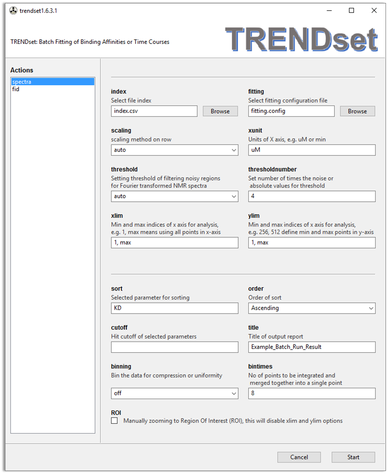
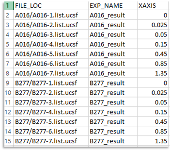
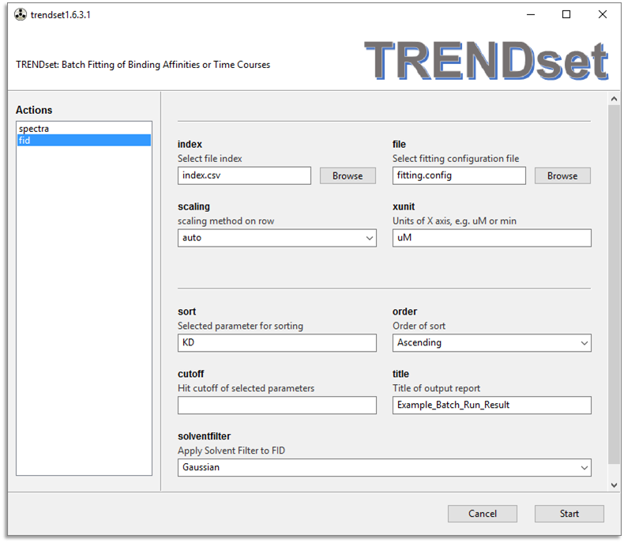

## TRENDset - Batch Fitting and Binding Affinities or Time Courses 
### Description  
- TRENDset is a new program that works on a batch of titrations to
  determine the binding isotherm and <i>K<sub>D</sub></i> of each
titration, with ranking by <i>K<sub>D</sub></i> 
- Similar to TREND NMR, TRENDset has two menus, **`spectra`** and
  **`fid**, they function similarly with minor difference. 
- `TRENDset` is launched using `trendset.app` or `trendset.exe`. After
  the batch run is finished, an HTML report with suffix of 
`-batch_run_result.html` will be opened by browser automatically.  
#### Arguments - Read from an **`index`** file  
- **`index`**  
Unlike `Trendmain` or `TREND NMR`, `TRENDset` can read most options from `index` file, which is read by **`index`** File Chooser Widget.      
   
The `index` file should be a CSV format spreadsheet. Each column in the
spreadsheet stands for an argument, which is defined by its title (first
row of the speadsheet).  Three arguments are required to be be given 
in a `index` file. While other arguments are optional.  
	- Required Arguments:
		- **`FILE_LOC`**: File location  
**`FILE_LOC`** specified location of each file or directory for PCA 
calculation. It can be given as the absolute path of a certain file, such as
`/Users/username/data/titration1/1.ucsf`. **`FILE_LOC`** can also be a 
relative path to the `index` file. For example, if an index file `index.csv` 
is saved as `/Users/username/data/index.csv`, then the previous `1.ucsf`
can be given as relative path: `titration1/1.ucsf`.  
For Bruker Topspin directories, **`FILE_LOC`** specify `<expno>` level 
which contains processed spectra in `1r` or `2rr` in the `/pdata/1`
subdirectory. Since the `fid` or `ser` are also in the same `<expno>`
directory, **`spectra`** menu reads `brukerspectra` format while
**`fid`** menu reads `brukerfid` format data. See `brukerspectra` and
`brukerfid` in  [Trendmain manual](../../manual/CLI/trendmain.md) for
details.   
Similarly, TRENDset reads VnmrJ directories containing `fid` file or
`datdir/phasefile`. See 'agilentfid` and `agilentspectra` in  [Trendmain manual](../../manual/CLI/trendmain.md) for details.  
		- **`EXP_NAME`**: Experiment name   
TRENDset works on a batch of titrations or time series of NMR spectra.
**`EXP_NAME`** defines name of each titration (or time series). 
		- **`XAXIS`**: X axis  
In the **`XAXIS`** column the X axis (e.g. concentration) is defined for
each file. It will be used as the x-axis values for data fitting. It is
the same to the `xaixs` options set in
[Trendmain](../../manual/GUI/trendmaingui.md) and [TREND
NMR](../trendmain/README.md).  
An example of index file containing 2 titrations:     
   
	- Optional Arguments for PCA:  
These arguments are optional and most of them can be set in the GUI of 
TRENDset as  "global" arguments. However these arguments can also be 
defined in the 
`index` file to overwrite the "global" arguments. Each *experiment*
(EXP_NAME) may have its own optional arguments.  
The below arguments are used to do PCA calculation and their details can
be found in the [Trendmain GUI manual](../../manual/GUI/trendmaingui.md) and [Trendmain CLI manual](../../manual/CLI/trendmain.md).   
		- **`FILETYPE`**: `type` option in `trendmain` or `trendnmr` 
for choosing file 
format.  Although TRENDset can determine file type automatically. It can 
also be specified as the **`FILETYPE`** argument. By setting this argument 
you can analyze FID data in the **`spectra`** menu of TRENDset.  
		- **`SCALING`**: `scaling` option in `trendmain`, which applies scaling method applied on rows of the data matrix.   
		- **`COLUMNSCALING`**:  `columnscaling` option in `trendmain`, which applies scaling method on columns  of the data matrix.    
		- **`XUNIT`**:  `xunit` option n `trendmain` or `trendnmr`, 
which specifies the unit of x-axis (given by `XAXIS` column in the 
`index` file).   
		- **`THRESHOLD`** and **`THRESHOLDNUMBER`**:  `threshold` and
		  `thresholdnumber` options for `trendmain` and `trendnmr`,
it filters noise from NMR spectra.  
		- **`BINTIMES`**: `bintimes` option in `trendmain` and
		  `trendnmr`: Number of points to be integrated and merged
		  together into a single point. It is used to do traditional
uniform binning for NMR data.  
		- **`SOLVENTFILTER`**: `solventfilter` option in `trendmain` and
		  `trednmr` which specifies sovlent filter to FID signals.  
		- **`XLIM`** and **`YLIM`**: indices for selecting ROI, see
		  details in the next section.  
	- Optional Arguments for data fitting:  
		- **`FITTING_FUNC`**: Location of configuration files of fitting function. Its format will be described below.   
		- **`NORMALMODE`**: `normalmode` defines normalization mode as in [trendanalysis](../../manual/CLI/trendplot.md).  


#### Arguments - Read from TRENDset GUI  
There are two menus of TRENDset, **`spectra`** and  **`fid`** (shown
below),which are
desgined to analyze frequency and time domain of NMR data, respectively. 
In the GUI of **`spectra`** (shown above)  and **`fid`**, there are many
arguments that have introduced in
[Trendmain](../../manual/GUI/trendmaingui.md) and the ** Arguments - Read 
from an index file** section, including `scaling`, `xunit`, `threshold`, 
`thresholdnumber`, `xlim`, and `ylim`. If these arguments are not defined 
in the **`index`** file, they are read by the GUI of trendset for all 
batch of experiments to run.  
   
- `file` text box reads configuration file of fitting.  It can be 
generated by running [trendanalysis](../trendanalysis/fitting.md),
a `fitting.config` file will be generated in the result folder. Or it
can be created by a text editor in the following format (case-sensitive):  

```bash
Parameters: KD=0.05, y_end=1.0
Constants: Pt=0.05
Function: y_end * 1.0 / (2.0 * Pt) * (KD + x + Pt - sqrt((KD + x + Pt) ** 2
- 4.0 * x * Pt))
```  

This is an example of configuration file used to fit 1:1 protein-ligand binding isotherm.   
The line starts with **Function** is the function of binding isotherm
(Note it is a function, not an equation), which is  y =
\frac{(K_D+x+Pt-\sqrt{(K_D+x+Pt)^2-4xPt)}}{2Pt} \times y_{\_end} , 
the meaning of pararmeters can be seen in
[trendanalysis](../trendanalysis/fitting.md).    
The line starts with **Parameters** defines the parameters to fit, while
the values specified by the equation are the initial values. In this
example, KD, y_end are parameters to fit, while their initial values are
set as 0.05 and 1.0, respectivley. If initial values are not given, then
it will be set as 1.0.   
The line starts with **Constants** defines the constant values that is
fixed in the fitting. Here the Pt is fixed as 0.05. The Pt can also be
defined in the **Parameters** line as a pararmeter instead of a
constant.  
The unit of KD and PT must be identical to the unit of x-axis, which is
defined by the `xaxis` argument.  For example, if the `xaxis` option is
set as *mM* then the unit of KD and PT are also *mM*.  
Another example is a configuration file of Exponential function:  
```bash
Exponential
Parameters: A, C, t
Constants: None
Function: C + A * exp(-x / t)
```
The line of **Exponential** is a flag turning on parameter intialization
of parameters defined in the **Parameters** line. Usually the auto parameter 
initialization  works fine and hence no initial parameters need to be given 
in the **Parameters** line. The `Constants: None` means there is no
constant needed in fitting.   
- `sort` argument defines which parameter to be sorted in the
  batch results. By default `KD` will be sorted.  
- `order` defines the order of sorting. By default sorted values will be
  outputed in the ascending order.  
- `cutoff` defines the criteria of "hit". Values larger smaller than
  `cutoff` in a descending order, or smaller than `cutoff` in an
ascending order will be considered  as "hit" and colored in green in the
generated table.   
- `title` is the title of output report. TRENDset will create a result
  folder named as `title` (with spaces removed if there are any).
PCA results, preview of selected ROIs, fitting results of each
experiment will be saved to the subdirectories named as
`TITLE/EXP_NAME/`.  
- `XLIM` defines the indices of x-axis for analysis, e.g.
`1, max` means using all pionts in x-axis. `450, 500` means
use points from 450 to 500. The definition of "points" is identical to
`index` in Bruker Topspin.  
- `YLIM` defines indices of y-axis for analysis if the input
data has 2 dimensions.  
- `ROI` argument allows manually select ROI. When it is checked, it will turn off `XLIM` and `YLIM` options, and a preview of ROI of the first spectrum will pop up, allowing selection of ROI manually. See [TREND NMR](../trendmain/README.md) for details.  
