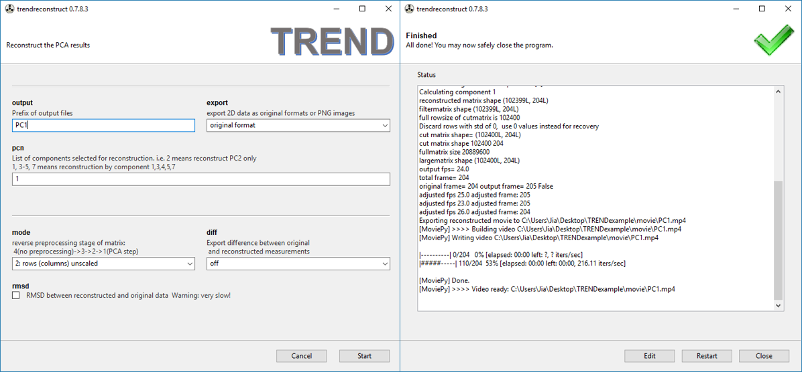

## Tutorial: Extract the time courses of respiration and heart contraction
  
(This MRI movie is courtesy of Jens Frahm and coworkers at Max-Planck-Institut fur
Biophysikalische Chemie in Gottingen and is available at:
[http://www.biomednmr.mpg.de/index.php?option=com_content&task=view&id=132&Itemid=38#Cardio](http://www.biomednmr.mpg.de/index.php?option=com_content&task=view&id=132&Itemid=38#Cardio))   

  
### 1. Do PCA on the movie  
Select the movie named as `cardiac-rtMRI.avi` in the unzippped 
`TRENDexample` folder. Run PCA using `trendmaingui` with row scaling method 
set as `noscaling`,  and `reconstruct` option turned on to save files for
reconstruction.  
To do this at the command line, `cd` to the directory where the 
`cardiac-rtMRI.avi` is, and run:  
`trendmain.exe -f cardiac-rtMRI.avi -t movie -s noscaling --reconst --report`   
### 2. Visualize PCA results  
When the PCA  calculation finishes, run `trendplotgui` with `readparm` 
option set as `Yes` to read arguments from the just finished `trendmaingui`. 
Set `pcn` as 2 to show the first two components as well as scree plot. To 
visualize results obtained from PCA on movie, TREND will extract time of 
frames and use it as ticks in X-axis. If not specified, the default units 
will be seconds.  
To do this at the  command line, use `trendplot.exe -r -e -n 2`   
  
When `trendplotgui` finishes, PC1 and PC2 are plotted. It is clear that 
PC1 represents time course of two breaths and that PC2 tracks the cardiac 
osciallation between diastole and systole.  
  
From the scree plot we can find that PC1 and PC2 contribute to ~50% of 
the total variance.  
  
### 3. Reconstructing Movies from only PC1 and PC2
It will be interesting to see movies reconstructed by only PC1 or PC2. Run 
`trendreconstructgui` and use the following settings.   
  
Leaving most settings at the default. Set the `prefix for the output` to 
`PC1`. It can be seen that a `PC1.mp4` is generated once `trendreconstructgui` 
finishes.  
The command line usage is: `trendreconstruct.exe -r -n 1 -e -o PC1`  
  
Above is `PC1.mp4` (a frame from `PC1.mp4` in PDF)  
Playing the PC1 movie shows only respiartion.  
A movie clip `PC2.mp4` reconstructed from PC2 is generated in the same way:  
  
Its command line usage is: `trendreconstruct.exe -r -n 2 -e -o PC2`  
  
Above is `PC2.mp4` (a frame from `PC2.mp4` in PDF)  
Playing the PC2 movie shows only the heart beating.  
