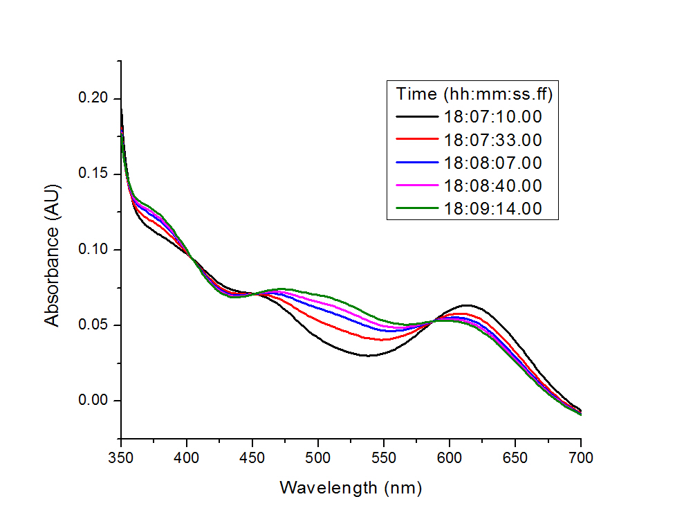
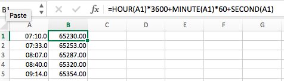
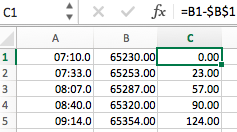
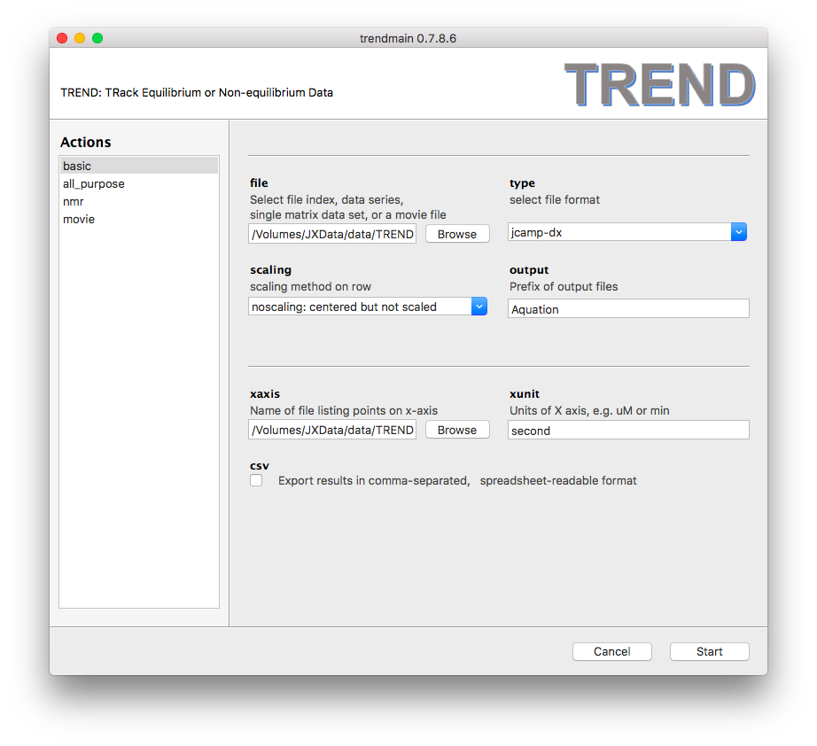
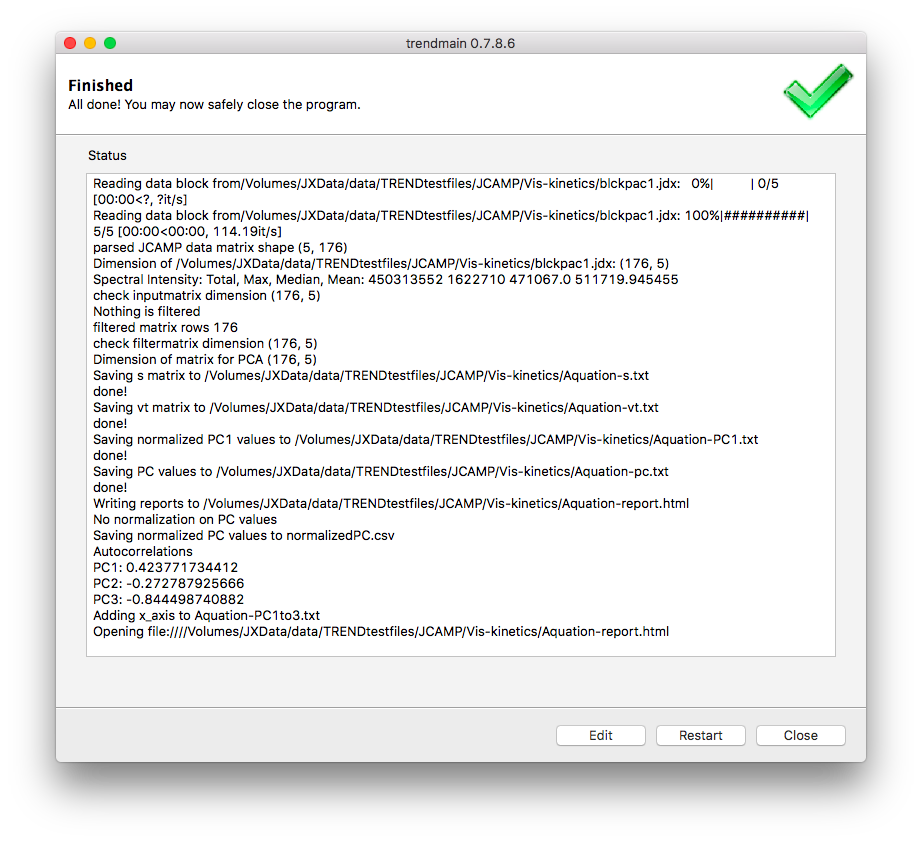
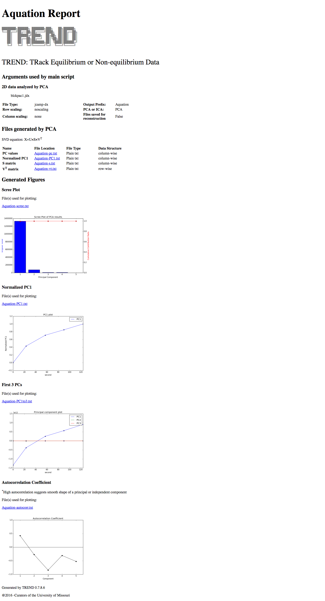

## Tutorial: Kinetics of Visible Spectra in one JCAMP-DX file: the Aquation of trans-[Co(en)<sub>2</sub>Cl<sub>2</sub>]<sup>+</sup>
### Introduction  
- [JCAMP-DX](http://www.jcamp-dx.org) is an internationally accepted format 
that is suitable for spectra collected from a wide range of methods, spectroscopy, 
and instrumentation. A single JCAMP-DX spectrum can store a series of spectra using multi **BLOCKS**   
- Here is a simple example of obtaining the kinetics of aquation of trans-[Co(en)
<sub>2</sub>Cl<sub>2</sub>]<sup>+</sup> from a single JCAMP-DX 
[file](http://wwwchem.uwimona.edu.jm:1104/spectra/testdata/blckpac1.jdx), 
which includes a series absorbance (Vis) spectra using 5 data blocks.    
- More examples of JCAMP-DX data can be found at [http://wwwchem.uwimona.edu.jm:1104/spectra/testdata/index.html](http://wwwchem.uwimona.edu.jm:1104/spectra/testdata/index.html)
- Basic information on the experiments can be found in the header of the 
downloaded [`blckpac1.jdx`](http://wwwchem.uwimona.edu.jm:1104/spectra/testdata/blckpac1.jdx) file:  
```bash
##TITLE= Aquation of trans-[Co(en)2Cl2]+
##DATA TYPE= LINK
##BLOCKS= 5
##ORIGIN= Dept of Chem, UWI, Mona, JAMAICA
##OWNER= public domain
##TITLE= (t1) Aquation of trans-[Co(en)2Cl2]+
##JCAMP-DX= 4.24
##DATA TYPE= UV/VIS SPECTRUM
##BLOCK_ID=1
##ORIGIN= Dept of Chem, UWI, Mona, JAMAICA $$Exported PE UV WinLab Data File
##OWNER= public domain
##DATE= 96/11/04
##TIME= 18:07:10.00
##SPECTROMETER/DATA SYSTEM= PERKIN-ELMER LAMBDA 19 UV/VIS/NIR UV
```  

- The Vis spectra series are displayed here with their time stamps:  



### Steps
#### 1. Prepare `xaxisfile` by extracting time information from all blocks (Optional)  
- The time courses of the aquation of trans-[Co(en)<sub>2</sub>Cl<sub>2</sub>]<sup>+</sup> 
was recoreded in this example. This time at which 
each spectrum(block) was collected is given  
by the `##TIME` field, for example:   
```bash
##TIME= 18:07:10.00
```   

- Although TREND does not need the temporal information to perform PCA analysis on 
this kinetic experiment, it will be needed to plot the time-course 
of the reaction with its time scale.  
- Since the `x axis` points in `xaxisfile` must be integer or 
floating point numbers, these need to be extracted from the 
JCAMP-DX (`.jdx` or `.dx`) file.  


- 1.1. Extract time information  
I. This can be done manually or running the following command in a Linux 
or macOS terminal using this syntax:   
```bash
cat blckpac1.jdx |grep "TIME"|awk '{print $2}' > time.txt
```  
II. Then the `time.txt` contains the following lines:  
```bash
18:07:10.00
18:07:33.00
18:08:07.00
18:08:40.00
18:09:14.00
```  

- 1.2. Convert `time.txt` to `xaxisfile`  
I. Open `time.txt` using `Excel` or `OpenOffice`  
II. Convert time to seconds in `Excel`  
The time format in the A column is `hh:mm:ss.ff`, the simplest way 
is to convert time to units of seconds in column B, using the formula 
depicted. This may require first setting the format of the cells of 
column B to "general".  
  
III. Calculate time change as difference between each time 
point to the first time point
  
IV. Now save the column C to a file `x-axis.txt`, which will be used as 
`xaxisfile` for `trendmain` or `trendplot`  
```bash  
0.00
23.00
57.00
90.00
124.00
```  

#### 2. Do PCA on the multi-block JCAMP-DX file  
2.1 First launch `trendmaingui`, and specify options as illustrated in the menu:  
  
2.2 Press the `Start` button, TREND will run quickly, resulting in text 
appearing in the window as shown:   
    
The corresponding command is: 
```bash
trendmain.exe -f blckpac1.jdx -t jcamp -s noscaling  -x x-axis.txt -u second -o Aquation --report
```

2.3 After `trendmain` finishes, a report in HTML format appears, and in this example is named
`Aquation-report.html`.  Its scree plot (a bar chart) indicates that there is only principal 
component.   
  

Note that TREND does not currently support reconstruction of JCAMP-DX files.
