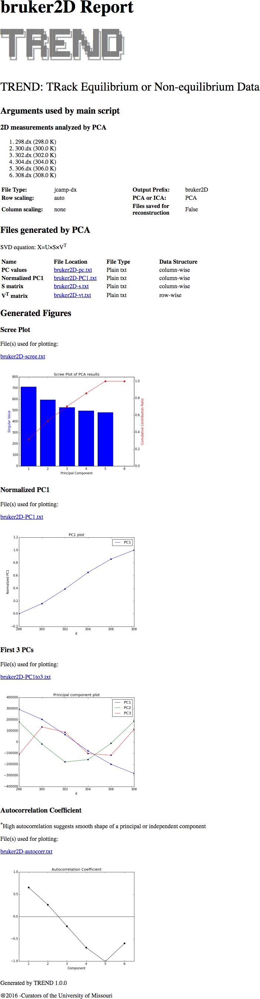

## Tutorial: Temperature dependence from a series of Bruker 2D spectra in JCAMP-DX format
### Introduction   
- As introduced in the [multi-block JCAMP-dx tutorial](tutorial_aqua.md), 
JCAMP-DX formats support a wide range of instruments, including NMR 
spectrometers. 
- Bruker, Agilent(Varian), and JOEL can export their NMR FID or Fourier 
transferred spectra into [JCAMP-DX NMR](http://www.jcamp-dx.org/protocols/dxnmr01.pdf) format.  
- In this tutorial, a temperature-dependent series of TROSY spectra are 
converted into `JCAMP-DX` files by Bruker Topspin and processed by TREND  
  

### 1. Convert spectra into JCAMP-DX format  
- In topsin, open the dataset to save,  Run `tojdx` command, or choose 
File -> Save menu, choose `Save data set in a JCAMP-DX file`.  
  
- Then set `Type of archive file` as `JCAMP IDFF/DUP`, which is a data 
compression method 
- Set "Include these data types" as "RSPEC", which means only the real part 
spectra will be saved. (Topspin does not support saving complex part of 
2D and higher dimensional data).  
  
- The resulting JCAMP-DX file contains all of the spectral parameters, such as 
```bash
##TITLE=2H, 15N phosphorylated PMM 49.2 mg/mL
130uL Protein+ 14uL D2O+ 1.5 uL 1M DTT
17:30 ready 298K
##JCAMPDX= 6.0         $$ Bruker NMR JCAMP-DX V2.0
##DATA TYPE= nD NMR SPECTRUM
##DATA CLASS= NTUPLES
##NUM DIM= 2
##ORIGIN= Bruker BioSpin GmbH
##OWNER= jxzr4
$$ 1.83.2.2.2.1 TOPSPIN     Version 3.2
$$ 2016-11-21 16:50:13.848 -0600  TIGERS\jxzr4@BCHEM-MTHOOD7
$$ Compression mode = diff/dup
##.OBSERVE FREQUENCY= 800.147784601106
##.OBSERVE NUCLEUS= ^1H
##.ACQUISITION MODE= SIMULTANEOUS (DQD)
##.ACQUISITION SCHEME= Echo-Antiecho
##.AVERAGES= 32
##.DIGITISER RES= 22
##SPECTROMETER/DATA SYSTEM= spect
##.PULSE SEQUENCE= b_trosyetf3gpsi
##.SOLVENT NAME= H2O+D2O
##.SHIFT REFERENCE= INTERNAL, H2O+D2O, 1, 10.55175
##AUDIT TRAIL= $$ (NUMBER, WHEN, WHO, WHERE, PROCESS, VERSION, WHAT)
$$ ##TITLE= Audit trail, TOPSPIN        Version 3.2
$$ ##JCAMPDX= 5.01
$$ ##ORIGIN= Bruker BioSpin GmbH
$$ ##OWNER= jxzr4
```   
However, only data blocks with `NTUPLE` flags are spectra data points, e.g.:  
```bash 
##NTUPLES= nD NMR SPECTRUM
##VAR_NAME=  FREQUENCY1,    FREQUENCY2,      SPECTRUM
##SYMBOL=    F1,            F2,              Y
##.NUCLEUS=  15N,           1H
##VAR_TYPE=  INDEPENDENT,   INDEPENDENT,     DEPENDENT
##VAR_FORM=  AFFN,          AFFN,            ASDF
##VAR_DIM=   1024,          512,             512
##UNITS=     HZ,            HZ,              ARBITRARY UNITS
##FACTOR=    2.85073081136719, 7.01553520114943, 1
##FIRST=     11026.7633587518, 3584.93848778736, 59843
##LAST=      8110.46573872317, 0,            114128
##MIN=       8110.46573872317, 0,            -28692053
##MAX=       11026.7633587518, 3584.93848778736, 434652230
##PAGE= F1=11026.76335875
##FIRST=     11026.7633587518, 3584.93848778736, 59843
##DATA TABLE= (F2++(Y..Y)), PROFILE
511E9843K28587L71399J71595j27870B98455a39447j60615g0562C61445K88667
501F50112o8960A49008d27817k73897K66384D080J60198o5687c7512j30016j85721
490c53249k78022k37360J1398P3379J9158L03591E2916K79358j56003c8534F6056
478C67966J72514o4394k25803h0426m50052m14212o5060K62894L25962a64831
467a00860j32439j34424j45489l05759l51794J02464N29787a83818O349M831A27131
455D77261L1295k46188A09471P3478J97798R6259k21739a51898m02660n782a64097
443G8735i7959j11726e5991f938k71003l06782r0791L9382l3312j91345m2053
432i02842d01148E08379O13972k01345B36027a24369A22815K25456h2299p73502
422h55801k85067L70445c40540P9926k8334J15858o955j81836J1279d857B35563
410I9798e8704j08244k9053c4285C88374M55663l339C80548g219A3717K03582
399B17299Q3553A26178a34453j51309e1572D20383M24262J11290l34543A34421
388c10673j26656J79057C6952b2934l62655k52432Q8648b68527a32151c8836A08259
376A25876a84763l97725j21897K02392O8110l03568m69443l31490l0532K33088
366a335828M97431c81329h3708C06830N25625L06384k22775B91428b83843o7584
```

### 2. Prepare X axis file (optional)
We can prepare an X axis file containing temperatures for this spectra 
as `temp.txt`:  
```bash  
298
300
302
304
306
308
```  

### 3. Do PCA analysis on the JCAMP-DX series   
    
- Launch `trendmaingui` and choose JCAMP-DX files:  
   
- Press "Start" button, TREND will start working (decoding JCAMP-DX 
is slower than other formats, please wait patiently)  
   
- When the calculation finishes, the results can be seem in the html report:  
   


