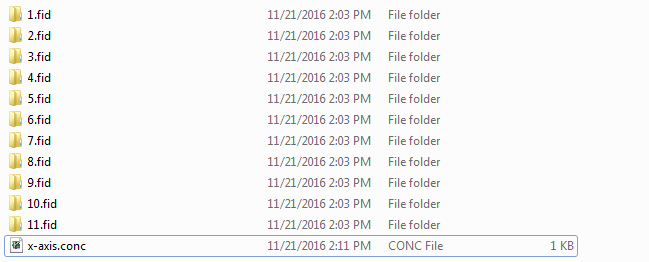
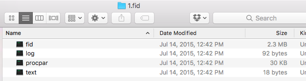
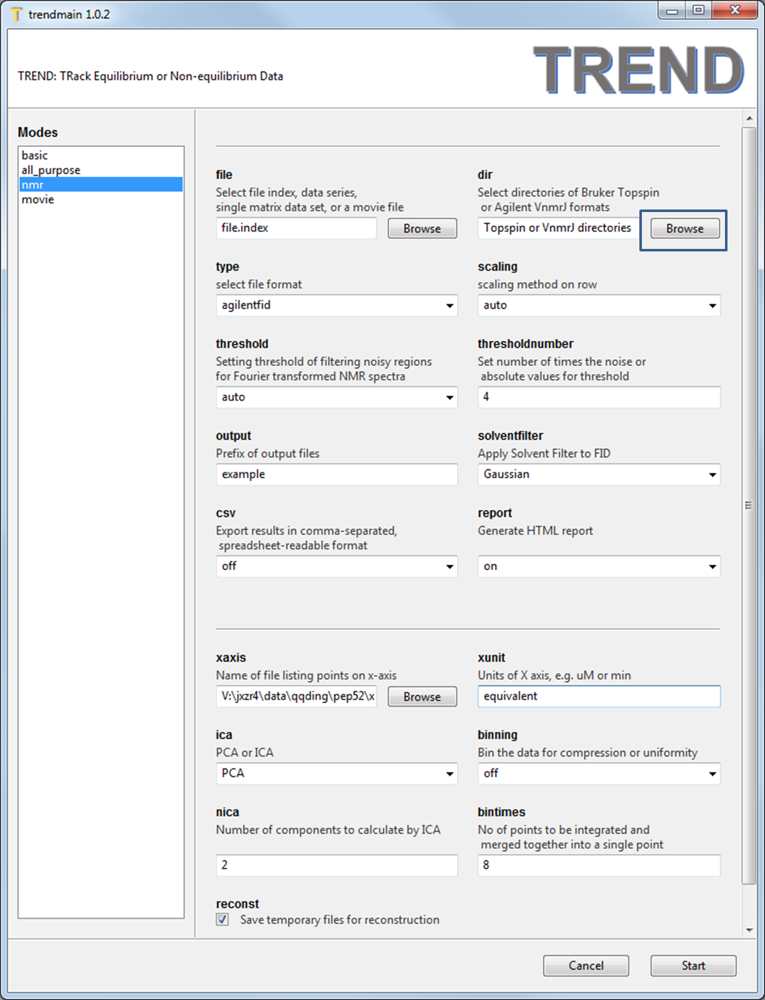
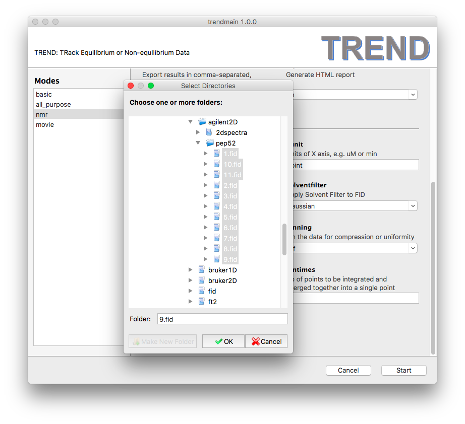
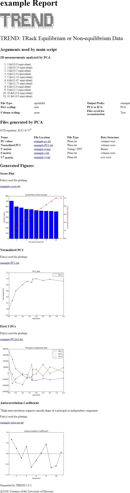
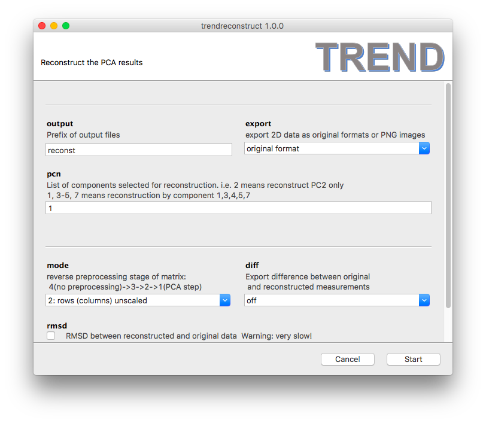
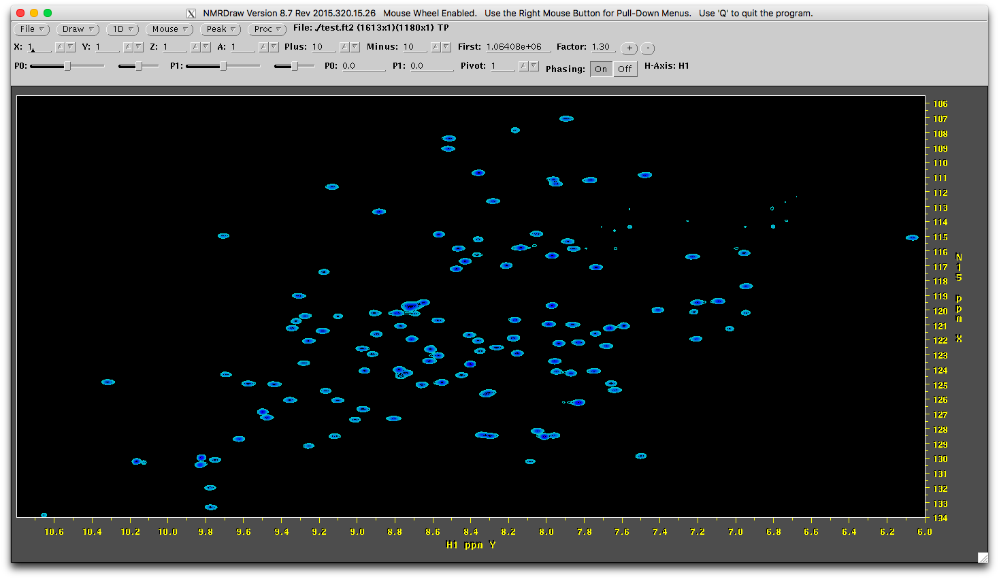
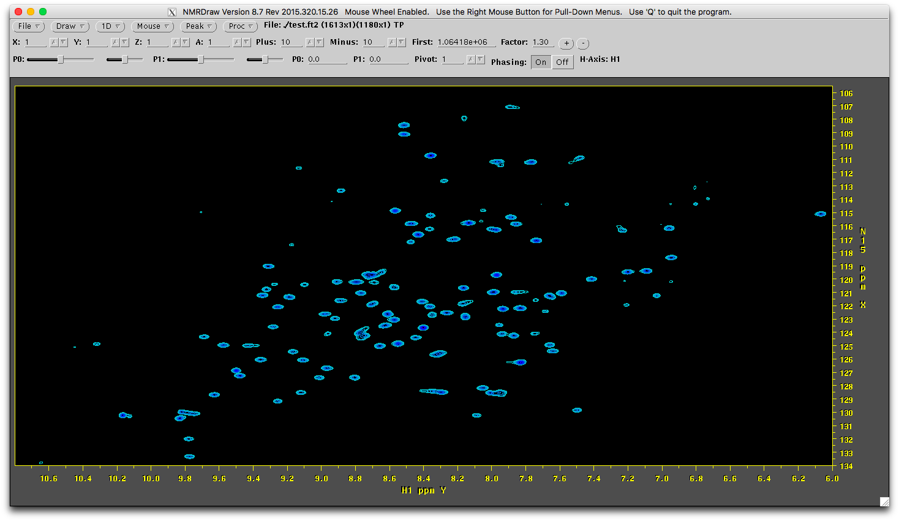
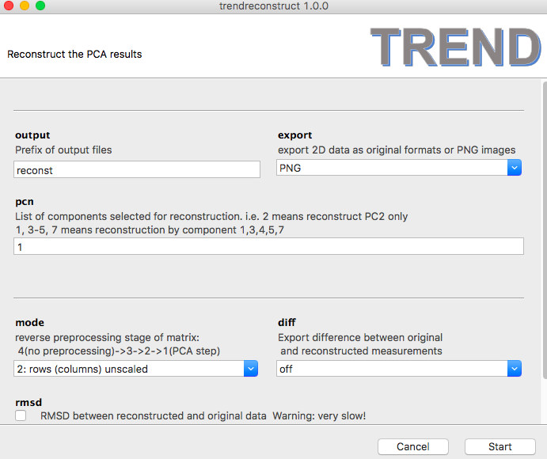
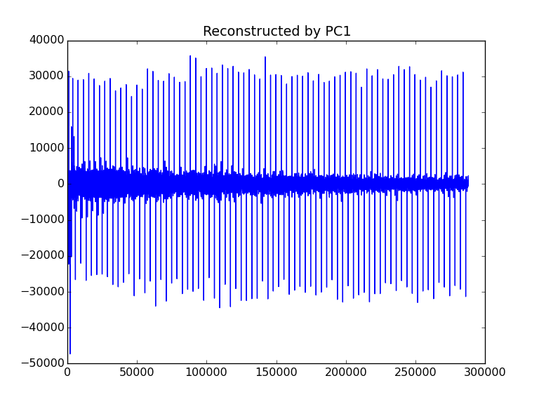

## Tutorial: Extract binding isotherms from unprocessed Agilent (Varian) FID
The example is a titration example of Varian format. 
  

In each folder (e.g. `1.fid`), there are just 4 files, which are `fid`, 
`log`, `procpar`, and `text`, which are not processed.  
     

### 1. (optional) make X axis file  
create an `x-axis.conc` using any text editor in the following format:  
```bash
0.0
0.25
0.5
1.0
1.33
1.67
1.75
2.0
2.5
3.0
4.0
```   

### 2. Do PCA on FID series  
   
- Launch `trendmaingui`, press `Browse` button of `dir` textbox to select all folders.   
- Note don't change `file` textbox as in the 
[A simple example](../doc/intro.md) because the 
Agilent and Topspin data formats are directories, while `file` is used 
to choose single files.   
   
- Set `type` as `agilentfid`, `scaling` as `auto`, xunit as `equivalence`, 
and read `x-axis.conc` file using `xaxis` text box. For the FID data, 
`solventfilter` could be applied to suppress solvent peaks. 
Here the default `Gaussian` is used.  
- Press the 'Start' button, the html report will be generated if 
`report` option is turned on.  
  


### 3. Reconstruct Agilent FID using only the first component  
- Luanch and run `trendreconstructgui` using default parameters, 
   
- A subfolder named as `reconst` (which is defined by the `output` option) 
is generated. The subfolder contains the reconstructed FID series with 
the same names of input files. They can be processed as the normal Agilent 
FID data. 
- The original `1.fid` has the spectrum as (processed by NMRPipe):    
   
- The reconstructed `1.fid` has a similar but different spectrum 
(processed by NMRPipe using the same NMRPipe scripts).  
  
- You can also visualize the reconstructed FIDs directly by choosing 
`export` format as `PNG`.  
  
- Then a series of PNG images named as `reconstX.png` will be generated. 
For example, `reconst1.png` is shown as:  
  


